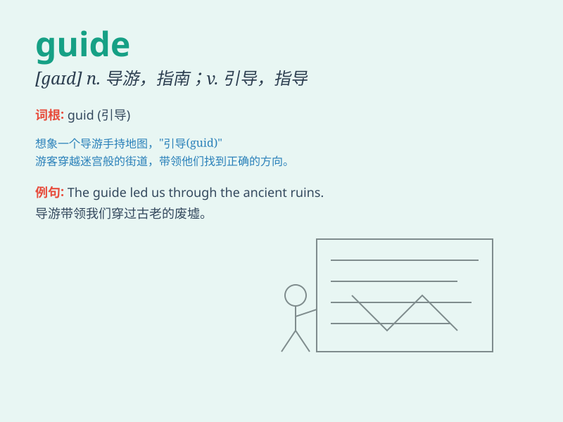

## guide

**英音:** _[gaɪd]_ **美音:** _[ɡaɪd]_

**译义:**
*n.领路人,导游者,向导,引导者,指南vt.指导,支配,管理,带领,操纵vi.任向导*

### 短语

+ **tour guide:** _导游_

+ **guide dog:** _导盲犬_

+ **user guide:** _用户指南_

+ **guidebook:** _旅行指南；指南手册_

+ **guide line:** _指导方针；准则_

### 例句

#### 例句1

> **The tour guide led us through the ancient city.**

**中文翻译:** 导游带领我们参观了古城。

**单词释义:** 导游

#### 例句2

> **This book serves as a guide to healthy eating.**

**中文翻译:** 本书可作为健康饮食指南。

**单词释义:** 指南；指导手册

#### 例句3

> **He guided the blind man across the street.**

**中文翻译:** 他引导盲人过马路。

**单词释义:** 引导；带领

### 背诵小故事

> A traveler was lost in a big forest. Just when he felt hopeless, a
kind fairy appeared as a guide. The guide led him out of the forest
safely. The traveler was very grateful.

**一位旅行者在大森林里迷路了。就在他感到绝望时，一位善良的仙女以向导的身份出现。这个向导带他安全地走出了森林。旅行者非常感激。**

### 图义

