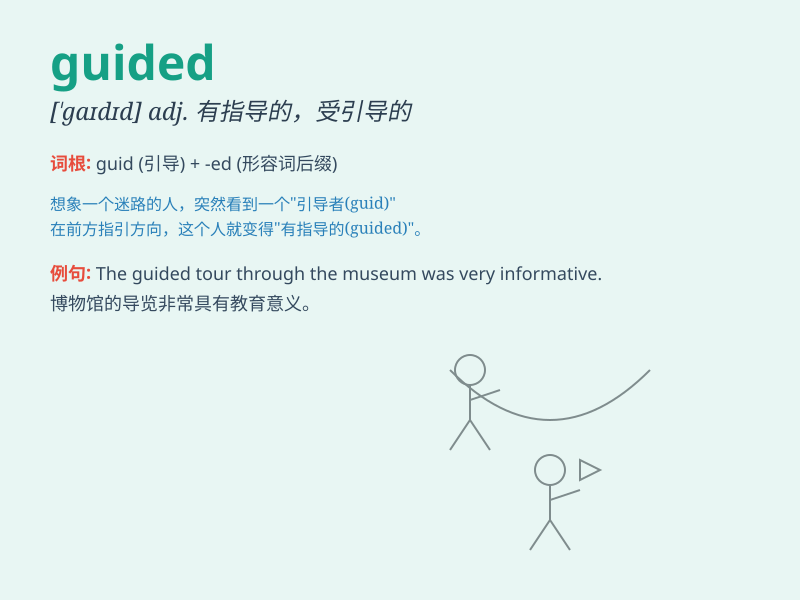

## guided

**英音:** _[ˈɡaɪdɪd]_ **美音:** _[ˈɡaɪdɪd]_

**译义:**
*adj.有指导的；受指导的；被引导的；被带领的（指人或事物处于被指导、被引导的状态）；n.导游（专指带领游客参观的人员）；v.引导，指导（guide的过去式和过去分词形式）*

### 短语

+ **guided tour:** _有导游的游览_

+ **guided missile:** _导弹；导向飞弹_

+ **guided meditation:** _引导式冥想_

+ **guided learning:** _引导式学习_

+ **guided reading:** _指导性阅读_

### 例句

#### 例句1

> **The tourists were guided through the museum by an experienced
guide.**

**中文翻译:** 游客们由一位经验丰富的导游带领着穿过了博物馆。

**单词释义:** 被引导；被带领

#### 例句2

> **He guided the blind man across the street.**

**中文翻译:** 他引导那位盲人穿过街道。

**单词释义:** 引导；指引

#### 例句3

> **The teacher guided us in our studies.**

**中文翻译:** 老师在学习方面指导我们。

**单词释义:** 指导；辅导

### 背诵小故事

> A lost traveler was in a big forest. Luckily, a kind guide appeared.
The guide led the traveler step by step and finally they got out of the
forest safely. The traveler was very grateful for the guided help.

**一位迷路的旅行者身处一片大森林。幸运的是，一位善良的向导出现了。向导一步一步地引领着旅行者，最终他们安全地走出了森林。旅行者非常感激这被引导的帮助。**

### 图义

