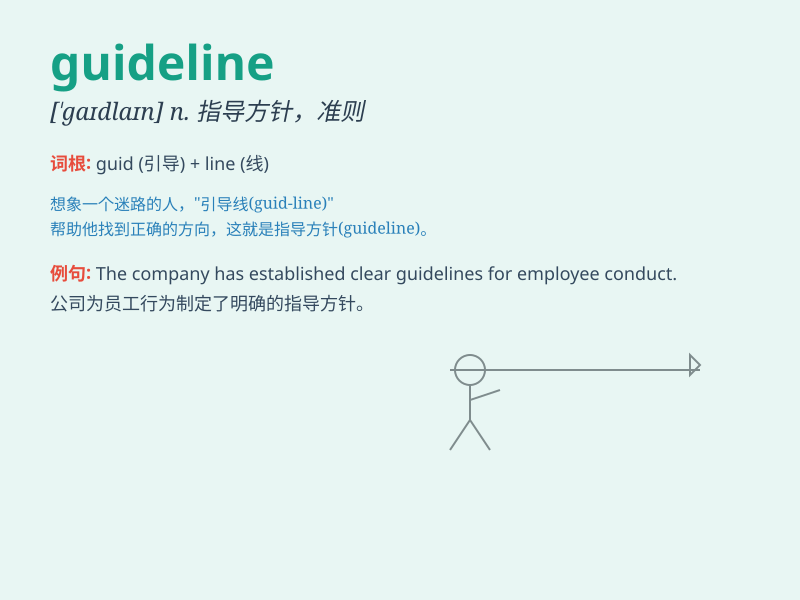

## guideline

**英音:** _[\'gaɪdlaɪn]_ **美音:** _[\'ɡaɪdlaɪn]_

**译义:** *n.方针*

### 短语

+ **design guideline:** _设计指南_

+ **safety guideline:** _安全准则_

+ **ethical guideline:** _道德准则_

+ **operational guideline:** _操作指南_

+ **quality guideline:** _质量指南_

### 例句

#### 例句1

> **The company issued new guidelines for employee conduct.**

**中文翻译:** 公司发布了新的员工行为准则。

**单词释义:** 准则；指导方针

#### 例句2

> **Please follow the guidelines when submitting your
application.**

**中文翻译:** 提交申请时请遵循指南。

**单词释义:** 指导方针

#### 例句3

> **These guidelines are designed to ensure safety in the
workplace.**

**中文翻译:** 这些准则旨在确保工作场所的安全。

**单词释义:** 准则

### 背诵小故事

> A lost traveler was in a forest. Just when he felt hopeless, he found
a guideline tied between trees. It led him out safely. The guideline was
like a rule or direction that saved him.

**一位迷路的旅行者在森林里。就在他感到绝望时，他发现树木之间系着一条指引线。它引领他安全走出。这条指引线就像规则或方向拯救了他。**

### 图义

