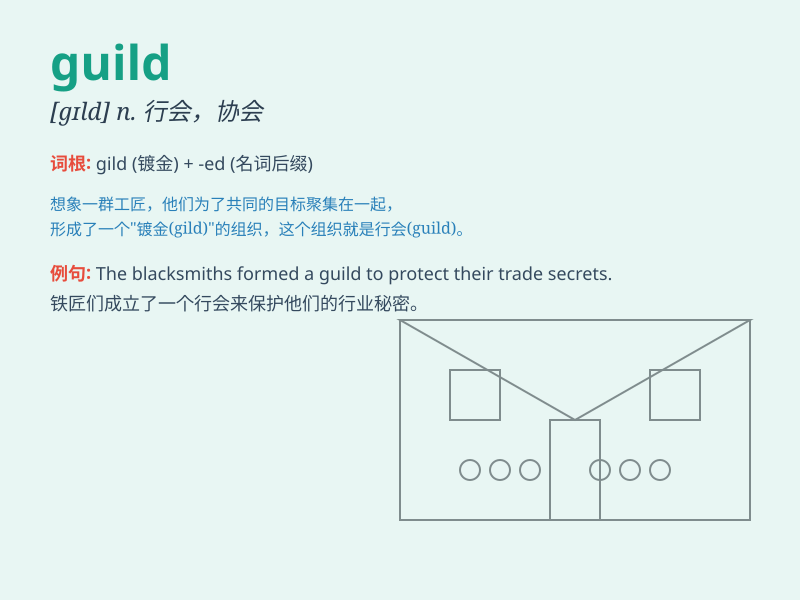

## guild

**英音:** _[gɪld]_ **美音:** _[ɡɪld]_

**译义:** *n.(中世纪的)行会,同业公会,协会,行业协会*

### 短语

+ **trade guild:** _同业公会_

+ **guild hall:** _同业公会会所_

+ **guild member:** _公会成员_

+ **craft guild:** _手工业行会_

+ **guild system:** _行会制度_

### 例句

#### 例句1

> **The guild of merchants was very powerful in the medieval
town.**

**中文翻译:** 商人行会在这座中世纪小镇非常强大。

**单词释义:** 公会；协会

#### 例句2

> **He joined the guild of painters to improve his skills.**

**中文翻译:** 他加入画家行会以提高自己的技能。

**单词释义:** 协会

#### 例句3

> **The guild organized various activities for its members.**

**中文翻译:** 协会为会员组织了丰富多彩的活动。

**单词释义:** 公会

### 背诵小故事

> In a magical land, there was a Guild of Wizards. They worked
together, sharing spells and wisdom. The Guild protected the people and
was known for its unity and power. Remember, \'guild\' is like this
group of powerful wizards.

**在一个神奇的土地上，有一个巫师公会。他们一起工作，分享法术和智慧。这个公会保护着人民，并以其团结和力量而闻名。记住，\'guild\'就像这个强大的巫师团体。**

### 图义

