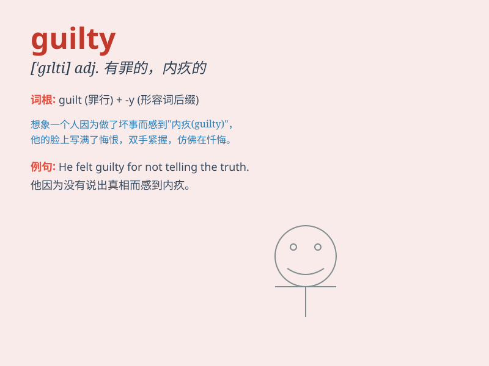

## guilty

**英音:** _[\'gɪltɪ]_ **美音:** _[\'ɡɪlti]_

**译义:** *adj.犯罪的,有罪的,心虚的*

### 短语

+ **feel guilty:** _感到内疚_

+ **be guilty of:** _犯有\...罪；对\...感到内疚_

+ **guilty conscience:** _内疚的良心_

+ **guilty party:** _有罪的一方_

+ **guilty verdict:** _有罪裁决_

### 例句

#### 例句1

> **He felt guilty for not telling the truth.**

**中文翻译:** 他为没有说出真相而感到内疚。

**单词释义:** 内疚的；有罪的

#### 例句2

> **The jury found her guilty of the crime.**

**中文翻译:** 陪审团认定她有罪。

**单词释义:** 有罪的

#### 例句3

> **She had a guilty look on her face when I caught her stealing the
candy.**

**中文翻译:** 当我发现她偷糖果时，她一脸愧疚。

**单词释义:** 内疚的

### 背诵小故事

> A thief was caught stealing. When asked, he looked down, feeling very
guilty. His heart was heavy as he knew he had done wrong. Finally, he
confessed and promised never to do it again.

**一个小偷在行窃时被抓住了。当被询问时，他低下头，感到非常内疚。他心情沉重，因为他知道自己做错了。最后，他坦白了并承诺再也不这样做了。**

### 图义

