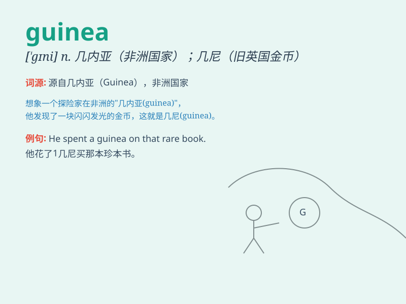

## guinea

**英音:** _[\'gɪnɪ]_ **美音:** _[\'ɡɪni]_

**译义:** *n.几内亚 几尼(英国的旧金币,值一镑一先令)*

### 短语

+ **guinea pig:** _豚鼠；实验对象；供实验的人_

+ **guinea fowl:** _珍珠鸡_

+ **New Guinea:** _新几内亚（岛）_

+ **Guinea worm:** _麦地那龙线虫_

+ **Guinea-Bissau:** _几内亚比绍（西非国家）_

### 例句

#### 例句1

> **The dress cost fifty guineas.**

**中文翻译:** 这件衣服花了五十几尼。

**单词释义:** 几尼（英国旧时金币名）

#### 例句2

> **Guinea pigs make very good pets.**

**中文翻译:** 豚鼠是非常好的宠物。

**单词释义:** 豚鼠

#### 例句3

> **The explorer ventured into the wilds of Guinea.**

**中文翻译:** 这位探险家冒险进入了几内亚的荒野。

**单词释义:** 几内亚（国家名）

### 背诵小故事

> A little girl went to a pet store and saw a cute guinea pig. She
loved it so much and wanted to take it home. The guinea pig had soft fur
and was very friendly. \'Guinea\' reminds us of this lovely pet.

**一个小女孩去宠物店，看到一只可爱的豚鼠。她非常喜欢，想把它带回家。这只豚鼠有着柔软的毛，非常友好。'guinea'让我们想起这只可爱的宠物。**

### 图义

