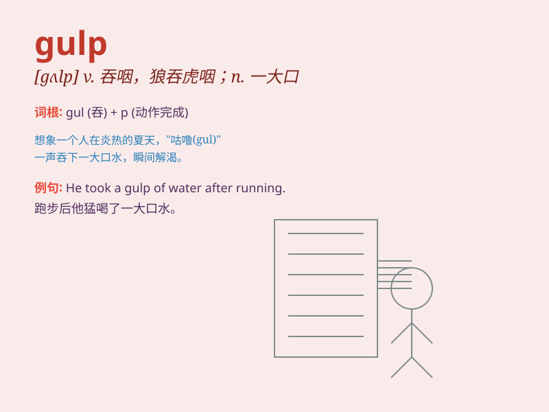

## gulp

**英音:** _[gʌlp]_ **美音:** _[ɡʌlp]_

**译义:** *vt.吞,一口吞(下),忍住,抑制vi.吞咽n.吞咽*

### 短语

+ **gulp down:** _大口吞下；狼吞虎咽地吃_

+ **gulp back:** _忍住；抑制（感情等）_

+ **gulp out:** _喘着气说出_

+ **gulp in:** _大口吸气_

+ **at one gulp:** _一口气；一饮而尽_

### 例句

#### 例句1

> **He gulped down the water.**

**中文翻译:** 他把水咽了下去。

**单词释义:** 大口地吞咽

#### 例句2

> **She gulped nervously before the interview.**

**中文翻译:** 采访前她紧张地咽了口口水。

**单词释义:** 吞咽，因紧张而咽口水

#### 例句3

> **The fish gulped air at the surface of the water.**

**中文翻译:** 鱼在水面上大口呼吸空气。

**单词释义:** 大口地吸气

### 背诵小故事

> A hungry puppy saw a bowl of food and gulped it down quickly. It was
so eager that it didn\'t even chew properly. Just like when we are
really thirsty and gulp down water in a hurry.

**一只饥饿的小狗看到一碗食物，很快就大口吞咽下去。它太急切了，甚至都没有好好咀嚼。就像我们非常口渴时匆忙大口喝水一样。**

### 图义

