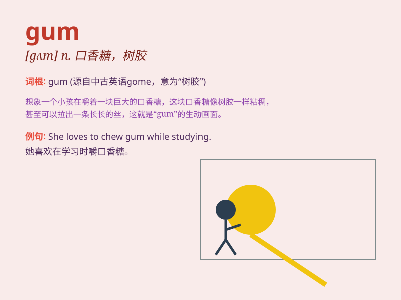

## gum

**英音:** _[gʌm]_ **美音:** _[ɡʌm]_

**译义:** *n.齿龈,树脂,橡胶,橡胶树,口香糖,香口胶,泡泡糖*

### 短语

+ **chew gum:** _嚼口香糖_

+ **gum disease:** _牙龈疾病_

+ **bubble gum:** _泡泡糖_

+ **gum up:** _搞乱；弄糟_

+ **gum tree:** _桉树_

### 例句

#### 例句1

> **I chewed a piece of gum to freshen my breath.**

**中文翻译:** 我嚼了一块口香糖来清新口气。

**单词释义:** 口香糖

#### 例句2

> **The gum on the sole of my shoe needs to be removed.**

**中文翻译:** 我鞋底上的口香糖需要去除。

**单词释义:** 胶；胶水

#### 例句3

> **The tree is oozing gum.**

**中文翻译:** 这棵树正在渗出口香糖。

**单词释义:** 树胶

### 背诵小故事

> A girl was chewing gum while walking in the park. Suddenly, the gum
got stuck on her shoe. She had to use a stick to remove it. Remember,
gum can be sticky and cause trouble!

**一个女孩在公园散步时嚼着口香糖。突然，口香糖粘在了她的鞋上。她不得不使用一根棍子把它弄掉。记住，口香糖可能会很粘并带来麻烦！**

### 图义

