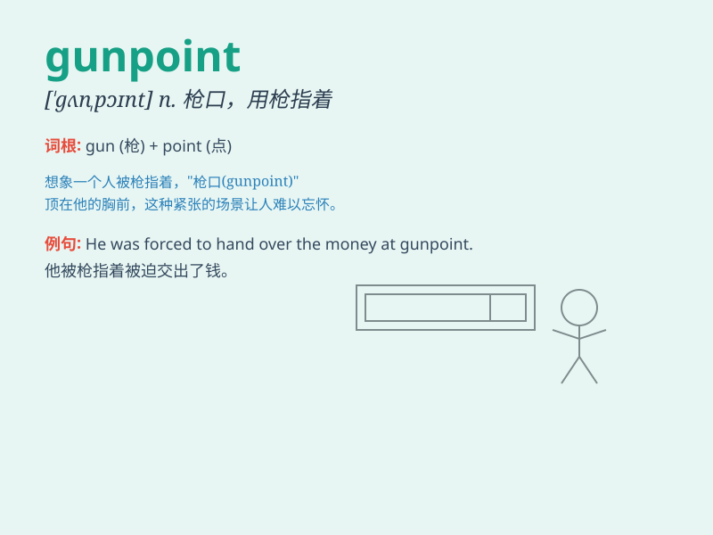

## gunpoint

**英音:** _[ˈɡʌnpɔɪnt]_ **美音:** _[ˈɡʌnpɔɪnt]_

**译义:** *n.枪口*

### 短语

+ **at gunpoint:** _在枪口威胁下_

+ **hold someone at gunpoint:** _用枪指着某人_

+ **threaten someone at gunpoint:** _用枪威胁某人_

+ **be forced at gunpoint:** _在枪口逼迫下_

+ **rob at gunpoint:** _持枪抢劫_

### 例句

#### 例句1

> **The thief held the shopkeeper at gunpoint and demanded money.**

**中文翻译:** 小偷用枪指着店主并索要钱财。

**单词释义:** 用枪威胁；在枪口的威胁下

#### 例句2

> **She was kidnapped at gunpoint and taken to an unknown
location.**

**中文翻译:** 她被持枪绑架并被带到一个未知地点。

**单词释义:** 在枪口威胁之下

#### 例句3

> **The bank teller was forced to open the safe at gunpoint.**

**中文翻译:** 银行出纳员被迫用枪胁迫打开保险箱。

**单词释义:** 在枪口逼迫下

### 背诵小故事

> A thief held a gun to the victim\'s head at gunpoint, demanding all
the money. The victim was terrified. Remember, \'gunpoint\' means being
threatened by a gun.

**一个小偷用枪指着受害者的头进行威胁，索要所有的钱。受害者非常害怕。记住，\'gunpoint\'意思是在枪口的威胁下。**

### 图义

