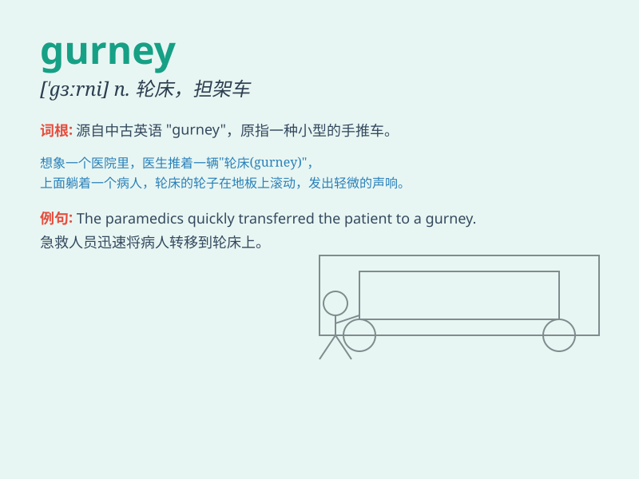

## gurney

**英音:** _[ˈɡɜːni]_ **美音:** _[ˈɡɜːrni]_

**译义:** *n.
①担架②手推车；轮床（医院中用于运送病人的有轮平台）③[人名]加尼（男子名，多用作姓氏）*

### 短语

+ **gurney table:** _轮床桌_

+ **gurney stretcher:** _轮床担架_

+ **gurney lift:** _轮床升降机_

+ **hospital gurney:** _医院轮床_

+ **emergency gurney:** _急救轮床_

### 例句

#### 例句1

> **The patient was moved on a gurney to the operating room.**

**中文翻译:** 病人被用轮床推到了手术室。

**单词释义:** 轮床

#### 例句2

> **The gurney was neatly stored in the corner of the hospital
corridor.**

**中文翻译:** 轮床被整齐地存放在医院走廊的角落里。

**单词释义:** 轮床

#### 例句3

> **The paramedics lifted the injured person onto the gurney with
care.**

**中文翻译:** 医护人员小心地把伤者抬上轮床。

**单词释义:** 轮床

### 背诵小故事

> One day, a patient was lying on a gurney and being rushed to the
emergency room. The gurney moved smoothly, ensuring the patient\'s
comfort and safety. It was a crucial tool for transporting the ill.

**有一天，一位病人躺在轮床上被紧急送往急诊室。轮床移动得很平稳，确保了病人的舒适和安全。它是运送病人的关键工具。**

### 图义

