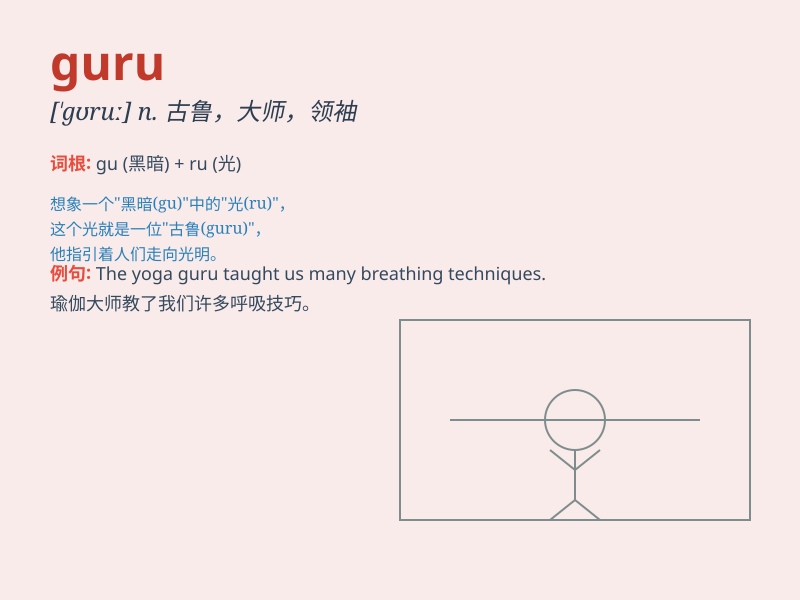

## guru

**英音:** _[\'gʊruː]_ **美音:** _[\'ɡʊru]_

**译义:**
*n.[印度教](个人的)宗教老师(或指导),(受下属崇敬的)领袖,头头*

### 短语

+ **management guru:** _管理大师_

+ **fashion guru:** _时尚大师_

+ **investment guru:** _投资大师_

+ **spiritual guru:** _精神领袖；心灵导师_

+ **guru of technology:** _技术专家_

### 例句

#### 例句1

> **The yoga guru led the class with grace and expertise.**

**中文翻译:** 瑜伽大师以优雅和专业的方式带领班级。

**单词释义:** 专家；权威；大师

#### 例句2

> **He became a guru in the field of finance after years of hard
work.**

**中文翻译:** 经过多年的努力，他成为了金融领域的大师。

**单词释义:** 权威；大师

#### 例句3

> **The spiritual guru offered guidance and wisdom to those seeking
inner peace.**

**中文翻译:** 这位精神导师为那些寻求内心平静的人提供了指导和智慧。

**单词释义:** 导师；大师

### 背诵小故事

> A young man was lost in his career. One day, he met a wise old man,
the guru. The guru gave him valuable advice and guided him to success.
The young man was grateful and always remembered the guru\'s wisdom.

**一个年轻人在职业生涯中迷失了方向。有一天，他遇到了一位睿智的老人，即宗师。宗师给了他宝贵的建议，并引导他走向成功。年轻人很感激，永远记住了宗师的智慧。**

### 图义

