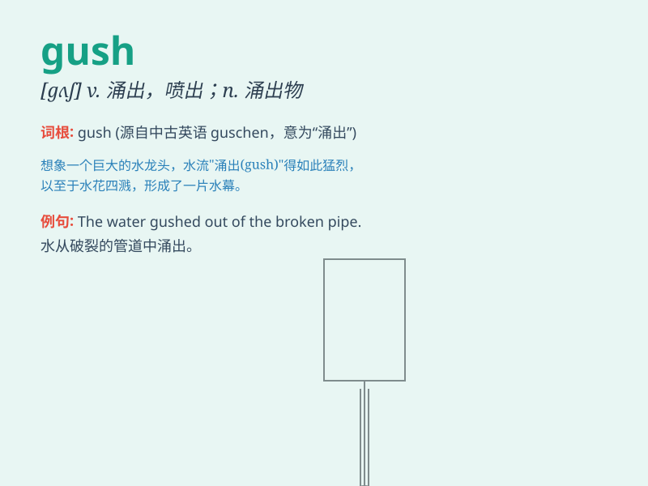

## gush

**英音:** _[gʌʃ]_ **美音:** _[ɡʌʃ]_

**译义:** *v.涌出*

### 短语

+ **gush forth:** _涌出；喷出_

+ **gush out:** _大量流出；滔滔不绝地说_

+ **gush over:** _过分称赞；热情洋溢地谈论_

+ **blood gush:** _鲜血涌出_

+ **oil gush:** _石油喷出_

### 例句

#### 例句1

> **The oil well began to gush black gold.**

**中文翻译:** 油井开始涌出黑金。

**单词释义:** 喷出；涌出

#### 例句2

> **She gushed about her new job with excitement.**

**中文翻译:** 她兴奋地滔滔不绝地谈论她的新工作。

**单词释义:** 滔滔不绝地说

#### 例句3

> **Blood was gushing from the wound.**

**中文翻译:** 鲜血从伤口中涌出。

**单词释义:** 涌出；大量流出

### 背诵小故事

> A fire hydrant was damaged, and water began to gush out. It was like
a wild river, flowing rapidly and forcefully. People were shocked by the
powerful and sudden flow.

**一个消防栓被损坏了，水开始喷涌而出。就像一条狂野的河流，迅速而有力地流淌着。人们被这强大而突然的水流震惊了。**

### 图义

