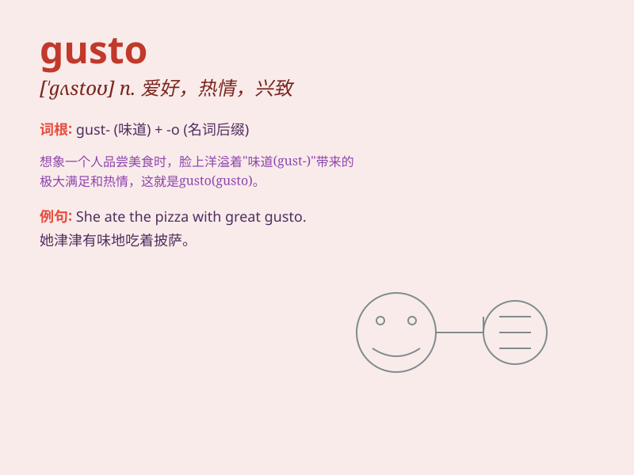

## gusto

**英音:** _[\'gʌstəʊ]_ **美音:** _[\'ɡʌsto]_

**译义:** *n.爱好,嗜好,趣味,由衷的高兴*

### 短语

+ **with gusto:** _热情地；津津有味地_

+ **do something with gusto:** _兴致勃勃地做某事_

+ **eat with gusto:** _吃得津津有味_

+ **sing with gusto:** _热情高歌_

+ **work with gusto:** _充满热情地工作_

### 例句

#### 例句1

> **He attacked the food with gusto.**

**中文翻译:** 他津津有味地大吃起来。

**单词释义:** 热情；兴致

#### 例句2

> **She danced with gusto.**

**中文翻译:** 她热情地跳舞。

**单词释义:** 热情；兴致

#### 例句3

> **They sang the song with great gusto.**

**中文翻译:** 他们兴致勃勃地唱着这首歌。

**单词释义:** 热情；兴致

### 背诵小故事

> A hungry bear entered a forest with great gusto. It sniffed around,
eager to find food. Its enthusiasm and excitement showed its gusto for
the hunt. Soon, it found a beehive and enjoyed the sweet honey.

**一只饥饿的熊满怀热情地走进了森林。它到处嗅着，急切地寻找食物。它的热情和兴奋展现出它对捕猎的兴致。很快，它找到了一个蜂巢，尽情享受着甜美的蜂蜜。**

### 图义

