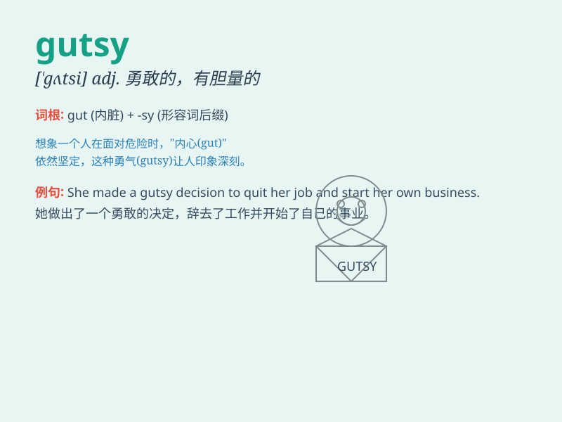

## gutsy

**英音:** _[ˈɡʌtsi]_ **美音:** _[ˈɡʌtsi]_

**译义:** *adj.勇敢的；有胆量的；有决心的*

### 短语

+ **gutsy move:** _勇敢的举动_

+ **gutsy performance:** _勇敢的表现_

+ **gutsy decision:** _大胆的决定_

+ **gutsy attitude:** _勇敢的态度_

+ **gutsy spirit:** _勇敢的精神_

### 例句

#### 例句1

> **She made a gutsy decision to quit her stable job and start her
own business.**

**中文翻译:** 她做出了一个勇敢的决定，辞去稳定的工作，自己创业。

**单词释义:** 勇敢的；有胆量的

#### 例句2

> **The athlete showed gutsy performance in the face of strong
competition.**

**中文翻译:** 这位运动员在激烈的竞争面前表现出了勇敢的表现。

**单词释义:** 勇敢的；有勇气的

#### 例句3

> **It was a gutsy move to confront the bully.**

**中文翻译:** 对抗那个恶霸是一个勇敢的举动。

**单词释义:** 勇敢的；大胆的

### 背诵小故事

> A young climber showed gutsy spirit when facing a difficult mountain.
He didn\'t give up and finally reached the top. His gutsy actions
inspired others.

**一位年轻的登山者在面对一座艰难的山峰时展现出了勇敢的精神。他没有放弃，最终到达了山顶。他勇敢的行为激励了其他人。**

### 图义

