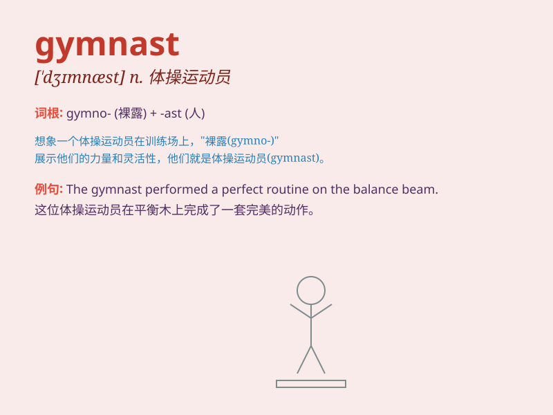

## gymnast

**英音:** _[\'dʒɪmnæst]_ **美音:** _[\'dʒɪmnæst]_

**译义:** *n.体操运动员*

### 短语

+ **elite gymnast:** _精英体操运动员_

+ **professional gymnast:** _职业体操运动员_

+ **acrobatic gymnast:** _技巧体操运动员_

+ **competitive gymnast:** _竞技体操运动员_

+ **female gymnast:** _女体操运动员_

### 例句

#### 例句1

> **The gymnast performed a perfect routine on the balance beam.**

**中文翻译:** 这位体操运动员在平衡木上完成了一套完美的动作。

**单词释义:** 体操运动员

#### 例句2

> **She has been training as a gymnast since she was five.**

**中文翻译:** 她从五岁起就一直作为体操运动员接受训练。

**单词释义:** 体操运动员

#### 例句3

> **The young gymnast showed great potential in the competition.**

**中文翻译:** 这位年轻的体操运动员在比赛中展现出了巨大的潜力。

**单词释义:** 体操运动员

### 背诵小故事

> A gymnast dreams of winning the gold medal. Every day, she practices
hard in the gym, doing flips and jumps. Her dedication makes her a great
gymnast.

**一位体操运动员梦想赢得金牌。每天，她都在体育馆努力练习，做翻转和跳跃动作。她的专注使她成为一名出色的体操运动员。**

### 图义

