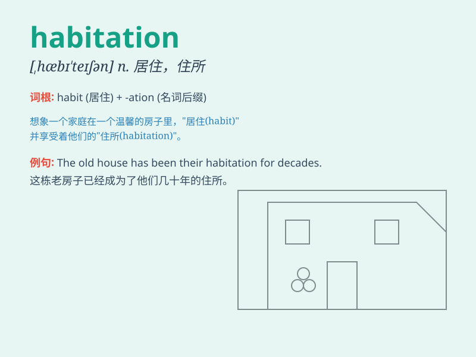

## habitation

**英音:** _[hæbɪ\'teɪʃ(ə)n]_ **美音:** _[,hæbɪ\'teʃən]_

**译义:** *n.居住,生活环境,住所*

### 短语

+ **human habitation:** _人类居住_

+ **habitation area:** _居住区域_

+ **suitable habitation:** _合适的住所_

+ **permanent habitation:** _永久居住_

+ **temporary habitation:** _临时住所_

### 例句

#### 例句1

> **The area is not suitable for human habitation due to its harsh
climate.**

**中文翻译:** 由于气候恶劣，这个地区不适合人类居住。

**单词释义:** 居住；住所

#### 例句2

> **The ancient ruins provide evidence of past habitation.**

**中文翻译:** 这些古老的废墟提供了过去有人居住的证据。

**单词释义:** 居住；居住点

#### 例句3

> **The search for habitation on other planets is an ongoing
scientific endeavor.**

**中文翻译:** 在其他星球上寻找可居住之处是一项正在进行的科学努力。

**单词释义:** 居住；栖息地

### 背诵小故事

> A little bird was looking for a habitation. It flew over many places
and finally found a cozy tree hole. It was so happy to have a safe and
warm place to call home.

**一只小鸟正在寻找栖息地。它飞过很多地方，最终找到了一个舒适的树洞。它很高兴拥有了一个安全温暖的家。**

### 图义

