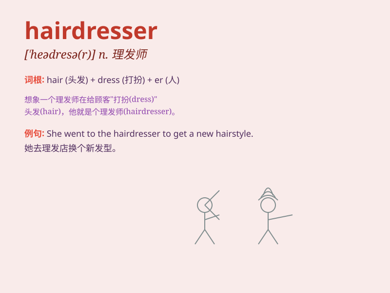

## hairdresser

**英音:** _[\'heədresə(r)]_ **美音:** _[\'hɛrdresɚ]_

**译义:** *n.(为女子做发的)理发师,美容师*

### 短语

+ **professional hairdresser:** _专业的理发师_

+ **experienced hairdresser:** _经验丰富的理发师_

+ **local hairdresser:** _当地的理发师_

+ **famous hairdresser:** _著名的理发师_

+ **skilled hairdresser:** _技术娴熟的理发师_

### 例句

#### 例句1

> **I need to visit the hairdresser to get a new hairstyle.**

**中文翻译:** 我需要去理发店换个新发型。

**单词释义:** 理发师

#### 例句2

> **The hairdresser cut my hair too short.**

**中文翻译:** 理发师把我的头发剪得太短了。

**单词释义:** 理发师

#### 例句3

> **She has been working as a hairdresser for five years.**

**中文翻译:** 她担任美发师已经五年了。

**单词释义:** 理发师

### 背诵小故事

> One day, I went to a shop. There was a person named Lily. She was
very good at cutting and styling hair. She was a hairdresser. People
loved her work because she made them look beautiful.

**有一天，我去了一家店。有一个叫莉莉的人。她非常擅长剪发和做发型。她是一名理发师。人们喜欢她的工作，因为她能让他们看起来很漂亮。**

### 图义

