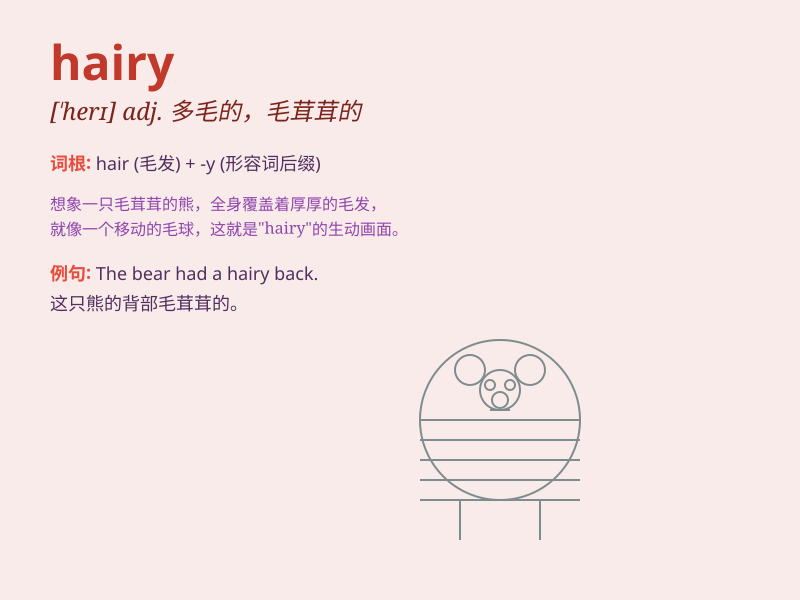

## hairy

**英音:** _[\'heərɪ]_ **美音:** _[\'hɛri]_

**译义:** *adj.多毛的,毛似的*

### 短语

+ **hairy chest:** _多毛的胸部_

+ **hairy monster:** _多毛的怪物_

+ **hairy situation:** _棘手的情况_

+ **hairy problem:** _复杂的问题_

+ **hairy adventure:** _惊险的冒险_

### 例句

#### 例句1

> **The dog has a hairy coat.**

**中文翻译:** 这只狗有一件毛茸茸的皮毛。

**单词释义:** 多毛的；毛茸茸的

#### 例句2

> **He had a hairy experience climbing that mountain.**

**中文翻译:** 他攀登那座山的经历令人毛骨悚然。

**单词释义:** 惊险的；困难的

#### 例句3

> **The caterpillar is very hairy.**

**中文翻译:** 毛毛虫的毛非常多。

**单词释义:** 多毛的；长满毛的

### 背诵小故事

> One day, I saw a strange creature in the forest. It was very hairy,
with long and thick fur all over its body. Its hairy appearance made it
look both mysterious and a little scary.

**有一天，我在森林里看到一个奇怪的生物。它浑身长满了毛，长长的、厚厚的毛覆盖全身。它毛茸茸的样子看起来既神秘又有点吓人。**

### 图义

