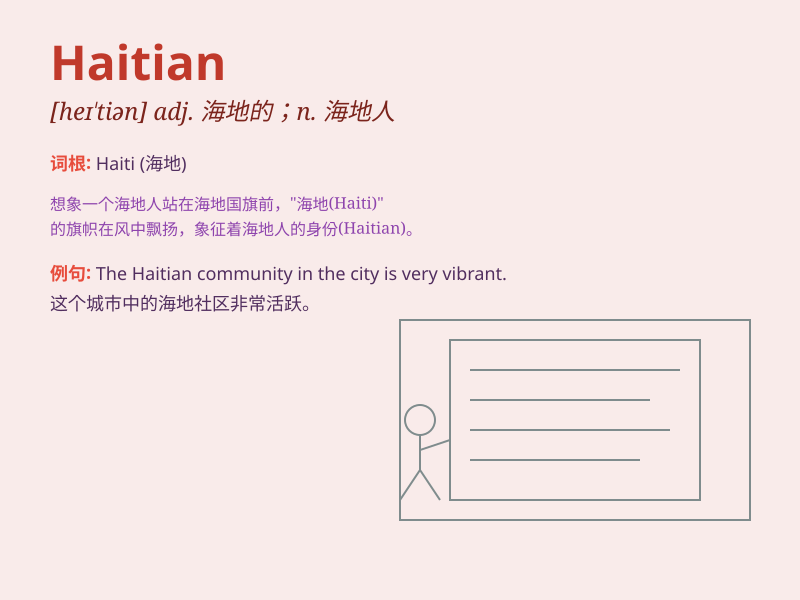

## Haitian

**英音:** _[heɪˈtiːən]_ **美音:** _[heɪˈtiːən]_

**译义:** *n.海地人；adj.海地的*

### 短语

+ **Haitian Creole:** _海地克里奥尔语_

+ **Haitian Revolution:** _海地革命_

+ **Haitian culture:** _海地文化_

+ **Haitian cuisine:** _海地美食_

+ **Haitian art:** _海地艺术_

### 例句

#### 例句1

> **The Haitian cuisine is known for its rich flavors.**

**中文翻译:** 海地的美食以其丰富的味道而闻名。

**单词释义:** 海地的；海地人的

#### 例句2

> **She has been studying Haitian history for years.**

**中文翻译:** 她研究海地历史已经多年了。

**单词释义:** 海地的；海地人的

#### 例句3

> **The Haitian artist\'s paintings are very popular.**

**中文翻译:** 这位海地艺术家的画作非常受欢迎。

**单词释义:** 海地的；海地人的

### 背诵小故事

> A Haitian boy named Tom was lost in a big city. But with his courage
and the help of kind people, he finally found his way home. The word
\'Haitian\' refers to something or someone related to Haiti.

**一个名叫汤姆的海地男孩在一个大城市里迷路了。但凭借他的勇气和好心人的帮助，他最终找到了回家的路。"Haitian"这个单词指的是与海地有关的事物或人。**

### 图义

