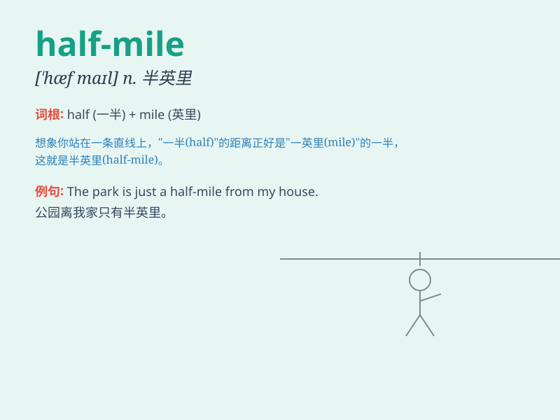

## half-mile

**英音:** _[ˌhɑːf ˈmaɪl]_ **美音:** _[ˌhæf ˈmaɪl]_

**译义:** *半英里*

### 短语

+ **half-mile race:** _半英里赛跑_

+ **half-mile walk:** _半英里步行_

+ **a half-mile stretch:** _半英里的延伸段_

+ **within half a mile:** _在半英里内_

+ **half-mile journey:** _半英里的旅程_

### 例句

#### 例句1

> **The runner completed a half-mile in under four minutes.**

**中文翻译:** 这位跑步者在不到四分钟内跑完了半英里。

**单词释义:** 半英里的距离

#### 例句2

> **It\'s a half-mile walk from here to the supermarket.**

**中文翻译:** 从这里到超市有半英里的步行路程。

**单词释义:** 半英里的路程

#### 例句3

> **The school is located about a half-mile away from my house.**

**中文翻译:** 学校距离我家大约半英里。

**单词释义:** 半英里的距离

### 背诵小故事

> One day, I decided to go for a run. I set a goal to reach a point
that was a half-mile away. I kept running, imagining that halfway there
was a big reward waiting for me. Finally, I made it to the half-mile
mark and felt proud.

**有一天，我决定去跑步。我设定了一个目标，要跑到半英里远的地方。我一直跑，想象着在半英里处有一个大奖励等着我。最后，我到达了半英里的标记，感到很自豪。**

### 图义

