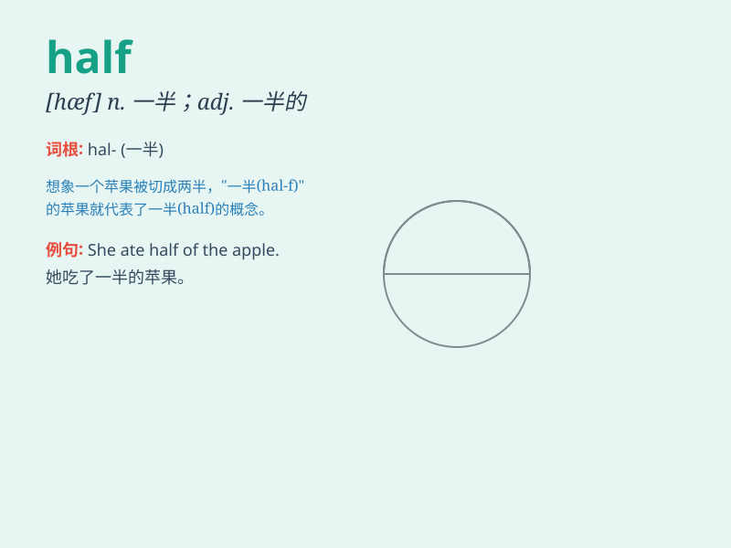

## half

**英音:** _[hɑːf]_ **美音:** _[hæf]_

**译义:**
*n.一半,半时,(球赛)半场,半学年adj.一半的,不完全的,半途的adv.一半地,部分地,相当的*

### 短语

+ **half an hour:** _半小时_

+ **half past:** _几点半_

+ **half way:** _中途；半路上_

+ **half price:** _半价_

+ **not half:** _非常；极其_

### 例句

#### 例句1

> **Half of the cake has been eaten.**

**中文翻译:** 蛋糕的一半已经被吃掉了。

**单词释义:** 一半

#### 例句2

> **It\'s half past three.**

**中文翻译:** 现在是三点半。

**单词释义:** 半

#### 例句3

> **I drank half a bottle of water.**

**中文翻译:** 我喝了半瓶水。

**单词释义:** 一半

### 背诵小故事

> One day, Tom had a pizza. But he was not very hungry, so he ate only
half of it. The other half was left for his friend. This shows that
\'half\' means one of two equal parts.

**有一天，汤姆有一个披萨。但他不是很饿，所以他只吃了一半。另一半留给了他的朋友。这表明'half'的意思是两个相等部分中的一个。**

### 图义

