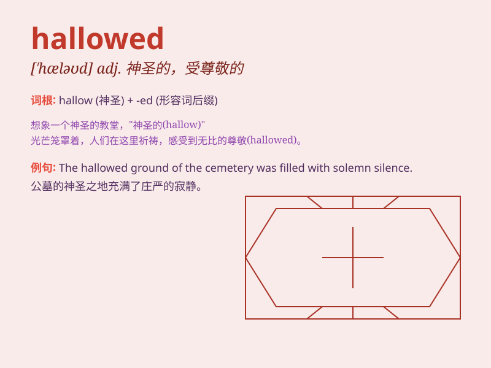

## hallowed

**英音:** _[\'hæləʊd]_ **美音:** _[\'hælod]_

**译义:** *adj.神圣化的,神圣的*

### 短语

+ **hallowed ground:** _圣地；神圣的地方_

+ **hallowed name:** _神圣的名字_

+ **hallowed tradition:** _神圣的传统_

+ **hallowed place:** _神圣之地_

+ **hallowed memory:** _神圣的记忆_

### 例句

#### 例句1

> **The hallowed halls of the university are filled with history.**

**中文翻译:** 大学神圣的大厅充满了历史。

**单词释义:** 神圣的

#### 例句2

> **This hallowed ground is where many soldiers made the ultimate
sacrifice.**

**中文翻译:** 这片神圣的土地是许多士兵做出最终牺牲的地方。

**单词释义:** 神圣的

#### 例句3

> **The hallowed tradition has been passed down for generations.**

**中文翻译:** 这一神圣的传统已经代代相传。

**单词释义:** 神圣的

### 背诵小故事

>
在一个古老的小镇，有一座被视为神圣的(hallowed)寺庙。每年特定的日子，人们都会怀着敬畏之心前往朝拜。这座寺庙见证了无数的祈祷和希望，它的神圣不可侵犯。

**在一个古老的小镇，有一座被视为神圣的寺庙。每年特定的日子，人们都会怀着敬畏之心前往朝拜。这座寺庙见证了无数的祈祷和希望，它的神圣不可侵犯。**

### 图义

