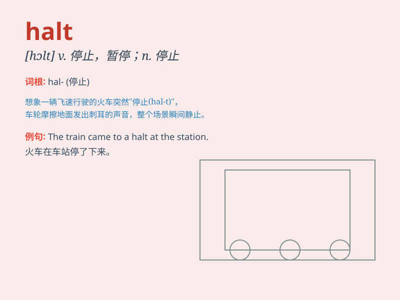

## halt

**英音:** _[hɔːlt]_ **美音:** _[hɔlt]_

**译义:**
*n.停止,暂停,中断vt.使停止,使立定vi.立定,停止,踌躇,有缺点*

### 短语

+ **come to a halt:** _停止；停下来_

+ **bring to a halt:** _使停止；使停下来_

+ **halt temporarily:** _暂时停止_

+ **halt abruptly:** _突然停止_

+ **halt indefinitely:** _无限期地停止_

### 例句

#### 例句1

> **The train came to a halt at the station.**

**中文翻译:** 火车在车站停了下来。

**单词释义:** 停止；停下

#### 例句2

> **The government has ordered a halt to the military operation.**

**中文翻译:** 政府已下令停止军事行动。

**单词释义:** 使停止；制止

#### 例句3

> **Work on the project came to a halt when the funding was cut.**

**中文翻译:** 当资金被削减时，该项目的工作就停止了。

**单词释义:** 停止；暂停

### 背诵小故事

> A group of travelers were walking in the forest. Suddenly, a huge
bear appeared. \'Halt!\' shouted the leader. Everyone stopped
immediately and stayed quiet. Thanks to this halt, they avoided danger.

**一群旅行者正在森林里行走。突然，一只巨大的熊出现了。"停下！"领队喊道。所有人立刻停了下来并保持安静。多亏了这次停下，他们避免了危险。**

### 图义

