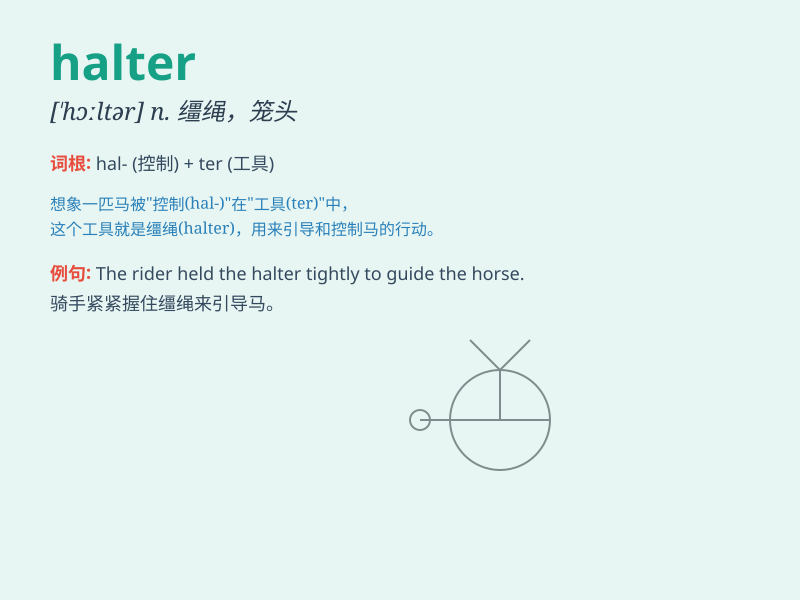

## halter

**英音:** _[\'hɔːltə]_ **美音:** _[\'hɔltɚ]_

**译义:** *n.缰绳,(马)笼头*

### 短语

+ **halter neck:** _露背领；绕颈式_

+ **halter dress:** _露背裙_

+ **halter top:** _露背装；绕颈上衣_

+ **horse halter:** _马笼头_

+ **halter bra:** _绕颈式胸罩_

### 例句

#### 例句1

> **She wore a halter top and jeans to the party.**

**中文翻译:** 她穿着吊带上衣和牛仔裤去参加聚会。

**单词释义:** 露背装

#### 例句2

> **The horse was led by a halter.**

**中文翻译:** 马被缰绳牵着。

**单词释义:** 缰绳

#### 例句3

> **He adjusted the halter on the donkey.**

**中文翻译:** 他调整了驴身上的缰绳。

**单词释义:** 缰绳

### 背诵小故事

> A horse was running freely in the field. But to control it, the owner
put a halter on its head. The halter helped keep the horse safe and
guided its movements.

**一匹马在田野里自由奔跑。但为了控制它，主人给它的头上套了一个笼头。笼头帮助保证马的安全并引导它的行动。**

### 图义

