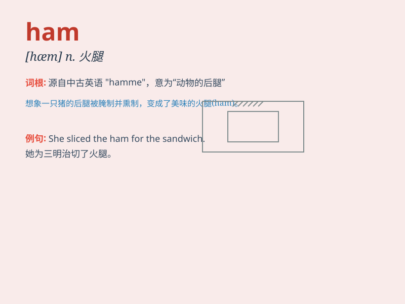

## ham

**英音:** _[hæm]_ **美音:** _[hæm]_

**译义:**
*n.火腿,大腿的后部,大腿及臀部,笨拙的演员adj.过火的,做作的v.演得过火*

### 短语

+ **ham actor:** _演技拙劣的演员_

+ **ham sandwich:** _火腿三明治_

+ **ham it up:** _装模作样；表演过火_

+ **Christmas ham:** _圣诞火腿_

+ **country ham:** _乡村火腿_

### 例句

#### 例句1

> **I had a slice of ham for breakfast.**

**中文翻译:** 我早餐吃了一片火腿。

**单词释义:** 火腿

#### 例句2

> **The actor\'s performance was a bit ham.**

**中文翻译:** 演员的表演有点火腿。

**单词释义:** 做作的表演

#### 例句3

> **He is a real ham when it comes to telling jokes.**

**中文翻译:** 在讲笑话方面，他真是个火腿。

**单词释义:** 爱表现的人，活宝

### 背诵小故事

> Once upon a time, there was a hungry man. He found a big ham in the
fridge. The ham was so delicious that he ate it all. From then on,
whenever he thought of \'ham\', he remembered that wonderful taste.

**从前，有个饥饿的人。他在冰箱里发现了一大块火腿。火腿太美味了，他全吃光了。从那以后，每当他想到'ham'这个单词，就会想起那美妙的味道。**

### 图义

