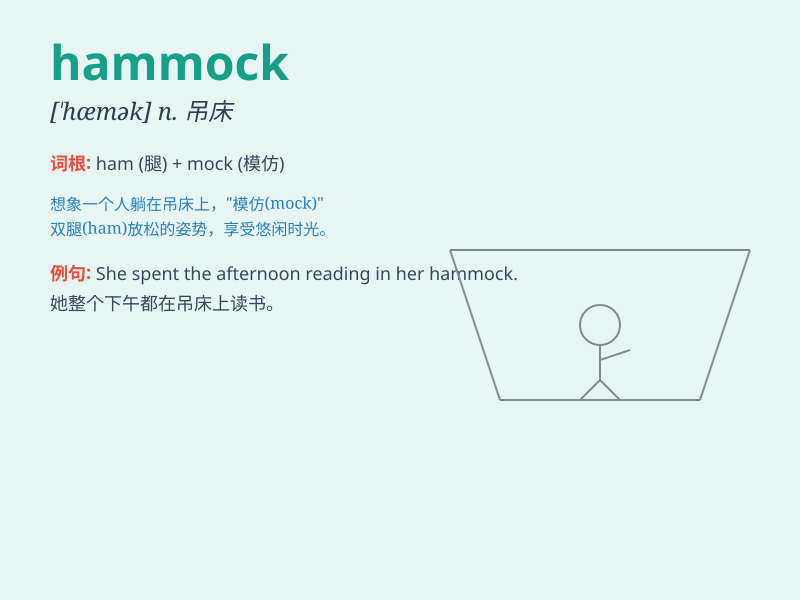

## hammock

**英音:** _[\'hæmək]_ **美音:** _[\'hæmək]_

**译义:** *n.吊床*

### 短语

+ **hammock chair:** _吊椅_

+ **hammock bed:** _吊床床_

+ **portable hammock:** _便携式吊床_

+ **double hammock:** _双人吊床_

+ **hammock camping:** _吊床露营_

### 例句

#### 例句1

> **I lay in the hammock and enjoyed the gentle breeze.**

**中文翻译:** 我躺在吊床上，享受着柔和的微风。

**单词释义:** 吊床

#### 例句2

> **The hammock swung gently between the two trees.**

**中文翻译:** 吊床在两棵树之间轻轻摇晃。

**单词释义:** 吊床

#### 例句3

> **She fell asleep quickly in the hammock under the shade of the
tree.**

**中文翻译:** 她在树荫下的吊床上很快就睡着了。

**单词释义:** 吊床

### 背诵小故事

> One hot summer day, Tom was so tired. He found a hammock under a big
tree. He lay in it and gently swayed. Soon, he fell asleep and had a
wonderful dream. The hammock gave him a cozy and relaxing time.

**在一个炎热的夏日，汤姆非常疲倦。他在一棵大树下发现了一个吊床。他躺在上面轻轻摇晃。很快，他就睡着了，做了一个美妙的梦。吊床给了他一段舒适和放松的时光。**

### 图义

