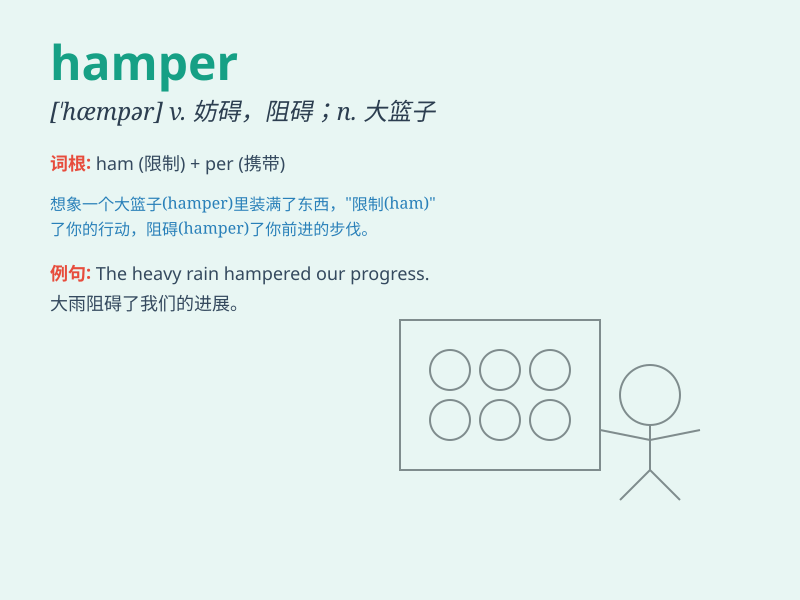

## hamper

**英音:** _[\'hæmpə]_ **美音:** _[\'hæmpɚ]_

**译义:** *v.妨碍,牵制*

### 短语

+ **hamper efforts:** _阻碍努力_

+ **hamper progress:** _妨碍进展_

+ **hamper movement:** _限制活动_

+ **hamper development:** _阻碍发展_

+ **be hampered by:** _被\...\...所阻碍_

### 例句

#### 例句1

> **The bad weather hampered our travel plans.**

**中文翻译:** 恶劣的天气阻碍了我们的旅行计划。

**单词释义:** 妨碍；阻碍

#### 例句2

> **The heavy box hampered her movement.**

**中文翻译:** 沉重的箱子阻碍了她的行动。

**单词释义:** 妨碍；牵制

#### 例句3

> **Lack of funds seriously hampered the project\'s progress.**

**中文翻译:** 资金匮乏严重阻碍了项目的进展。

**单词释义:** 阻碍；束缚

### 背诵小故事

> A man was on a picnic and brought a big hamper filled with food. But
the heavy hamper got stuck in the mud, hampering his plan to enjoy the
picnic smoothly.

**一个男人去野餐，带了一个装满食物的大篮子。但沉重的篮子陷进了泥里，妨碍了他顺利享受野餐的计划。**

### 图义

