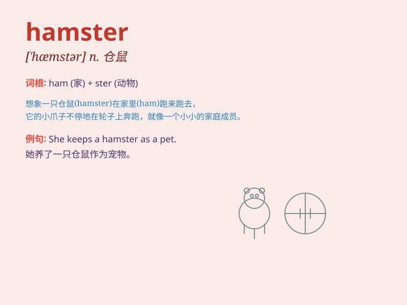

## hamster

**英音:** _[\'hæmstə]_ **美音:** _[\'hæmstɚ]_

**译义:** *n.东欧或亚洲产的大颊的鼠类*

### 短语

+ **golden hamster:** _金黄仓鼠_

+ **hamster wheel:** _仓鼠跑轮_

+ **domestic hamster:** _家养仓鼠_

+ **pet hamster:** _宠物仓鼠_

+ **wild hamster:** _野生仓鼠_

### 例句

#### 例句1

> **The hamster is running on the wheel in its cage.**

**中文翻译:** 仓鼠在笼子里的轮子上奔跑。

**单词释义:** 仓鼠

#### 例句2

> **I bought a cute hamster as a pet for my daughter.**

**中文翻译:** 我给女儿买了一只可爱的仓鼠作为宠物。

**单词释义:** 仓鼠

#### 例句3

> **The hamster hides food in its cheek pouches.**

**中文翻译:** 仓鼠将食物藏在颊囊中。

**单词释义:** 仓鼠

### 背诵小故事

> One day, a little boy saw a cute hamster in a pet store. The hamster
had chubby cheeks and was running fast on a wheel. The boy was so happy
and decided to take it home and become good friends with it.

**有一天，一个小男孩在宠物店里看到一只可爱的仓鼠。这只仓鼠有着胖乎乎的脸颊，在轮子上跑得很快。小男孩非常高兴，决定把它带回家并和它成为好朋友。**

### 图义

