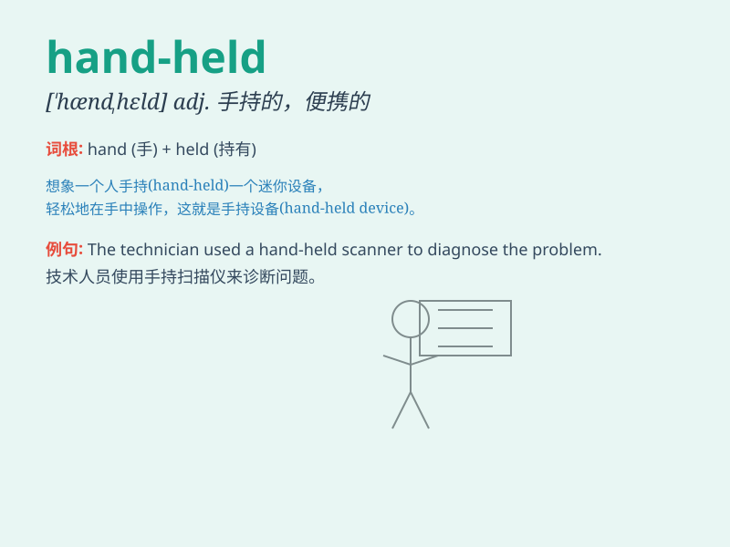

## hand-held

**英音:** _[\'hænd.held]_ **美音:** _[\'hænd.hɛld]_

**译义:**
*adj.手持的，便携式的（通常指设备或工具，表明其设计目的是为了方便携带和使用）*

### 短语

+ **hand-held device:** _手持设备_

+ **hand-held calculator:** _手持式计算器_

+ **hand-held camera:** _手持相机_

+ **hand-held torch:** _手持式手电筒_

+ **hand-held scanner:** _手持扫描仪_

### 例句

#### 例句1

> **The detective used a hand-held metal detector to search for
clues.**

**中文翻译:** 这位侦探使用手持式金属探测器来寻找线索。

**单词释义:** 手持式的

#### 例句2

> **She carried a hand-held fan to keep herself cool.**

**中文翻译:** 她拿着一把手持风扇给自己降温。

**单词释义:** 手持的

#### 例句3

> **The soldier held a hand-held communication device.**

**中文翻译:** 这名士兵拿着一个手持式通讯设备。

**单词释义:** 手持式的

### 背诵小故事

> One day, Tom was lost in a forest. Luckily, he found a hand-held
flashlight to light his way. With it in hand, he felt less scared and
finally found his way out.

**一天，汤姆在森林里迷路了。幸运的是，他找到了一个手持式手电筒照亮道路。手里拿着它，他感到不那么害怕，最终找到了出路。**

### 图义

