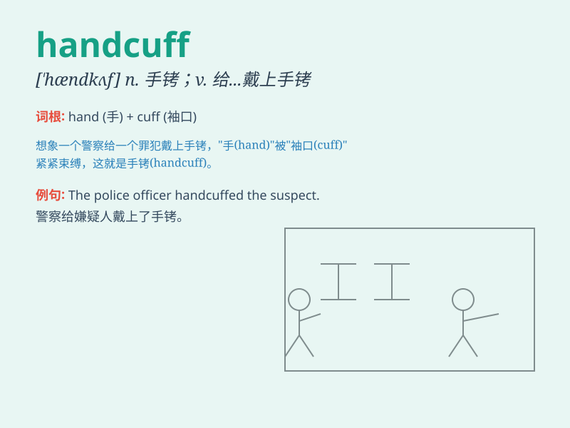

## handcuff

**英音:** _[\'hæn(d)kʌf]_ **美音:** _[\'hændkʌf]_

**译义:** *n.手拷v.上手拷*

### 短语

+ **put handcuffs on:** _给\...\...戴上手铐_

+ **be in handcuffs:** _戴着手铐_

+ **remove handcuffs:** _解开手铐_

+ **handcuff someone to something:** _将某人用手铐铐在某物上_

+ **tight handcuffs:** _紧的手铐_

### 例句

#### 例句1

> **The police handcuffed the suspect to prevent him from
escaping.**

**中文翻译:** 警察给嫌疑犯戴上手铐以防他逃跑。

**单词释义:** 给\...\...戴上手铐

#### 例句2

> **He was handcuffed and led away by the officers.**

**中文翻译:** 他被戴上手铐并被警察带走了。

**单词释义:** 戴上手铐

#### 例句3

> **The thief was handcuffed to the radiator until the police
arrived.**

**中文翻译:** 在警察到来之前，小偷被铐在了暖气片上。

**单词释义:** 用手铐铐住

### 背诵小故事

> A thief was caught stealing in the market. The police quickly put
handcuffs on his hands to prevent him from escaping. The handcuffs were
strong and shiny, making it impossible for the thief to move freely.

**一个小偷在市场偷东西被抓了。警察迅速给他的手戴上手铐以防他逃跑。手铐坚固又闪亮，让小偷无法自由活动。**

### 图义

