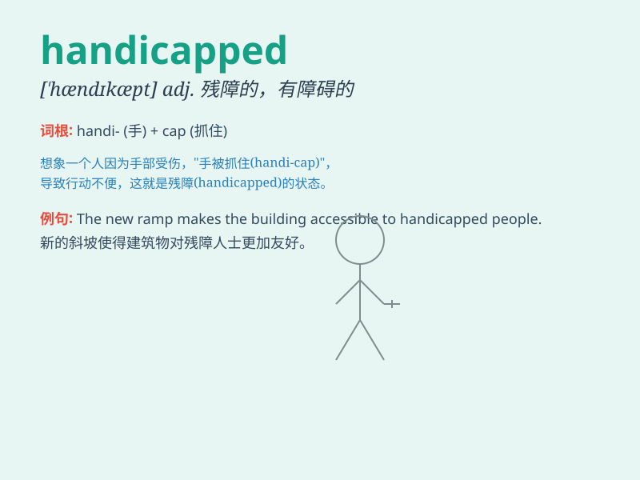

## handicapped

**英音:** _[\'hændɪkæpt]_ **美音:** _[\'hændɪkæpt]_

**译义:** *n.残疾人,身体有缺陷的人adj.残废的*

### 短语

+ **mentally handicapped:** _智力有缺陷的_

+ **physically handicapped:** _身体有残疾的_

+ **handicapped parking:** _残疾人停车位_

+ **handicapped access:** _残疾人通道_

+ **handicapped children:** _残疾儿童_

### 例句

#### 例句1

> **The handicapped man struggled to cross the street.**

**中文翻译:** 这位残疾男子艰难地穿过街道。

**单词释义:** 残疾的

#### 例句2

> **Special facilities are provided for the handicapped at the
airport.**

**中文翻译:** 机场为残疾人提供了特殊设施。

**单词释义:** 残疾的；有生理缺陷的

#### 例句3

> **She has always been very supportive of handicapped people.**

**中文翻译:** 她一直非常支持残疾人。

**单词释义:** 残疾的

### 背诵小故事

> A handicapped person named Tom struggled to walk. But with his strong
will, he learned to use special tools and finally overcame difficulties.
\'Handicapped\' means having a physical or mental disability that limits
one\'s abilities.

**有一个叫汤姆的残障人士，行走艰难。但凭借坚强的意志，他学会使用特殊工具，最终克服了困难。\'handicapped\'意思是有身体或精神上的残疾，限制了个人的能力。**

### 图义

