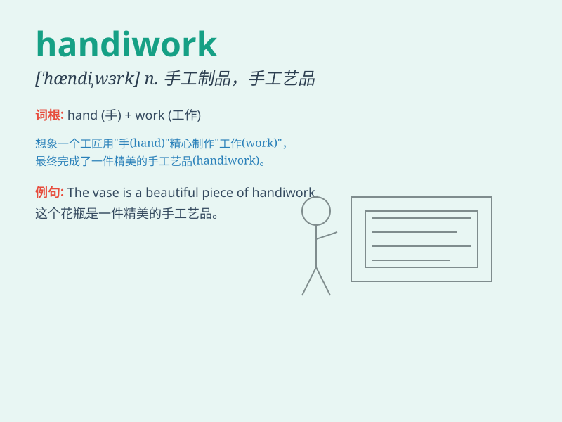

## handiwork

**英音:** _[\'hændɪwɜːk]_ **美音:** _[\'hændɪ\'wɝk]_

**译义:** *n.手工,手艺,手工*

### 短语

+ **the handiwork of:** _...的作品；...的成果_

+ **fine handiwork:** _精细的手工_

+ **skilled handiwork:** _熟练的手艺_

+ **exquisite handiwork:** _精美的手工艺品_

+ **traditional handiwork:** _传统的手工制品_

### 例句

#### 例句1

> **The beautiful vase is the handiwork of a local artist.**

**中文翻译:** 这个漂亮的花瓶是一位当地艺术家的手工制品。

**单词释义:** 手工制品；手艺

#### 例句2

> **The damage to the car was clearly the handiwork of vandals.**

**中文翻译:** 汽车的损坏显然是破坏者的杰作。

**单词释义:** （常指不良的）行为结果；成果

#### 例句3

> **I was impressed by the handiwork on display at the craft
fair.**

**中文翻译:** 我对工艺博览会上展出的手工制品印象深刻。

**单词释义:** 手工；手艺

### 背诵小故事

> One day, a thief was caught. The police found the stolen goods and
said, \'This is your handiwork.\' It means the things made or done by
someone, especially bad things. The thief had to admit it was his fault.

**一天，一个小偷被抓住了。警察发现了被盗物品并说：'这是你的手艺（作品，恶行）。'
它指某人所做的东西，尤指不好的事。小偷不得不承认是他的错。**

### 图义

