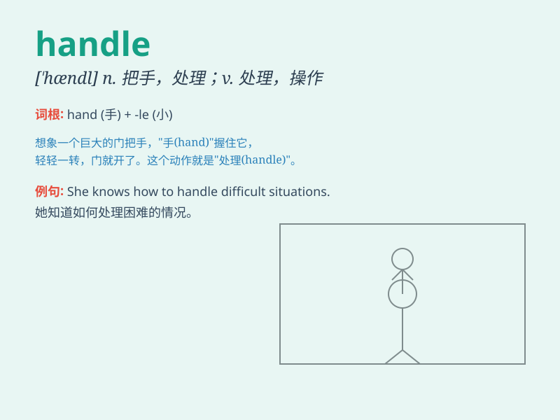

## handle

**英音:** _[\'hænd(ə)l]_ **美音:** _[\'hændl]_

**译义:**
*n.柄,把手,把柄,口实,手感vt.触摸,运用,买卖,处理,操作vi.搬运,易于操纵n.[计]句柄*

### 短语

+ **handle with care:** _小心轻放；小心处理_

+ **get a handle on:** _理解；掌握；驾驭_

+ **door handle:** _门把手_

+ **handle the situation:** _处理情况_

+ **handle the problem:** _处理问题_

### 例句

#### 例句1

> **The handle of the door was broken.**

**中文翻译:** 这扇门的把手坏了。

**单词释义:** 把手

#### 例句2

> **She knows how to handle difficult customers.**

**中文翻译:** 她知道如何应付难缠的顾客。

**单词释义:** 应付，处理

#### 例句3

> **This tool is easy to handle.**

**中文翻译:** 这个工具容易操作。

**单词释义:** 操作

### 背诵小故事

>
想象一个大力士，他轻松地握住（handle）巨大的杠铃，掌控着它的方向和重量。就像我们在生活中要学会握住各种机会和困难，handle
就是掌控、处理的意思。

**想象一个大力士轻松握住杠铃，就像我们要学会掌控机会和处理困难，以此记住
handle 意为掌控、处理。**

### 图义

