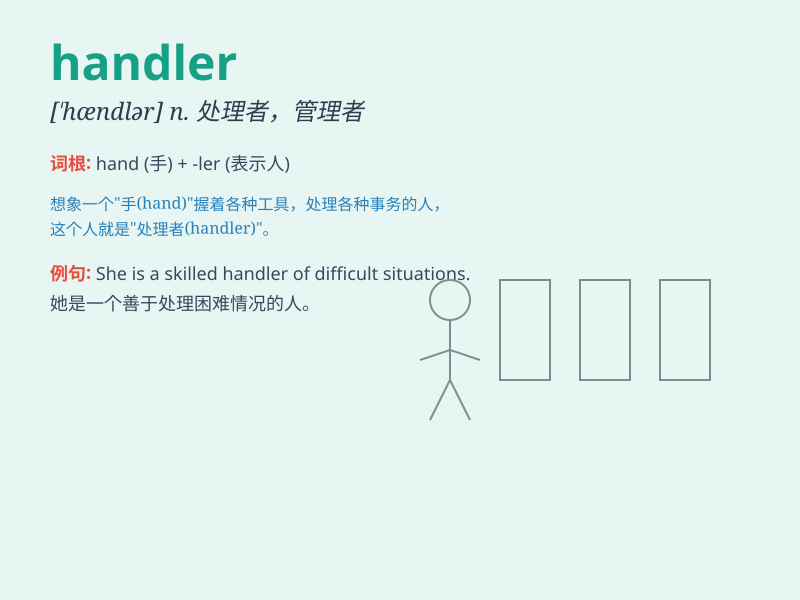

## handler

**英音:** _[\'hændlə]_ **美音:** _[\'hændlɚ]_

**译义:**
*n.处理者,管理者,训练者,(尤指拳击)教练(或助手),(犬马等的)训练者*

### 短语

+ **event handler:** _事件处理程序_

+ **error handler:** _错误处理程序_

+ **message handler:** _消息处理程序_

+ **request handler:** _请求处理程序_

+ **data handler:** _数据处理程序_

### 例句

#### 例句1

> **The dog handler trained the animal very well.**

**中文翻译:** 这位训犬员把这只动物训练得非常好。

**单词释义:** 训练者；驯兽员

#### 例句2

> **The event handler responded quickly to the problem.**

**中文翻译:** 这个事件处理程序对问题反应迅速。

**单词释义:** 处理者；处理程序

#### 例句3

> **She is a skilled handler of customer complaints.**

**中文翻译:** 她是处理客户投诉的能手。

**单词释义:** 处理者；操作者

### 背诵小故事

> A monkey was trained as a handler to manage a group of little
rabbits. It carefully took care of them, showing its handling skills.
One day, it successfully led the rabbits to find fresh carrots. The
monkey was a great handler!

**一只猴子被训练成管理员来管理一群小兔子。它细心地照顾它们，展现出了管理能力。有一天，它成功地带领兔子们找到了新鲜的胡萝卜。这只猴子是个很棒的管理员！**

### 图义

