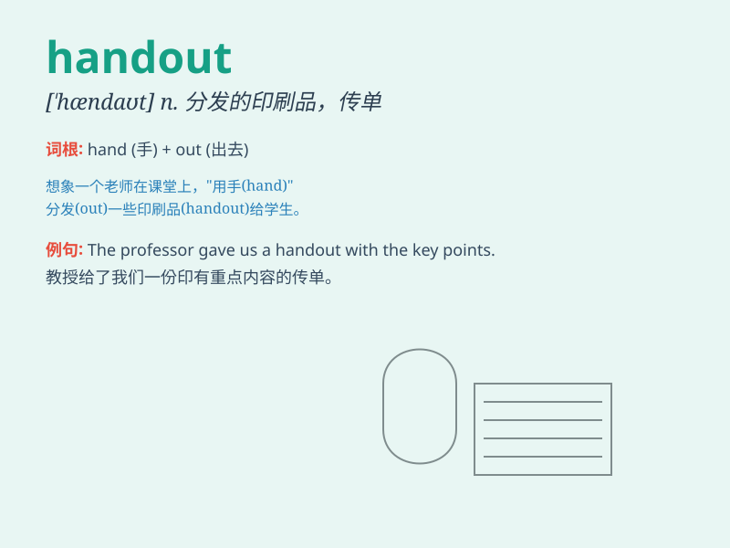

## handout

**英音:** _[\'hændaʊt]_ **美音:** _[\'hænd\'aʊt]_

**译义:** *n.分发的印刷品,新闻稿*

### 短语

+ **give out handouts:** _分发传单_

+ **classroom handout:** _课堂讲义_

+ **information handout:** _信息资料_

+ **handout materials:** _分发材料_

+ **receive a handout:** _收到一份分发物_

### 例句

#### 例句1

> **The teacher gave out handouts at the beginning of the class.**

**中文翻译:** 老师在上课开始时发了讲义。

**单词释义:** 讲义；传单

#### 例句2

> **The company provided handouts to explain the new policy.**

**中文翻译:** 公司提供了传单来解释新政策。

**单词释义:** 传单；资料

#### 例句3

> **We received handouts with useful information during the training
session.**

**中文翻译:** 我们在培训期间收到了带有有用信息的资料。

**单词释义:** 资料；分发的印刷品

### 背诵小故事

> One day, a teacher was giving handouts to students in the classroom.
The handouts had important knowledge for the exam. Students were happy
to receive them and started to study.

**有一天，一位老师在教室里给学生发讲义。这些讲义有考试的重要知识。学生们高兴地收到它们并开始学习。**

### 图义

