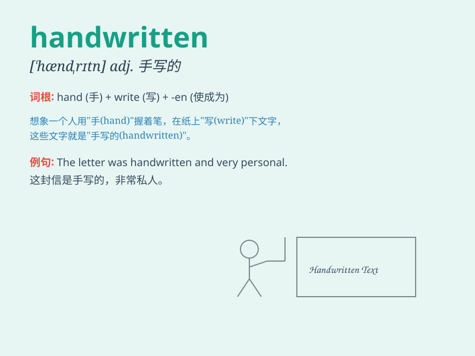

## handwritten

**英音:** _[hænd\'rɪtn]_ **美音:** _[\'hænd\'rɪtn]_

**译义:** * vbl.handwrite的过去分词 adj.手写的*

### 短语

+ **handwritten letter:** _手写的信_

+ **handwritten note:** _手写的便条_

+ **handwritten script:** _手写的文稿_

+ **handwritten signature:** _手写签名_

+ **handwritten text:** _手写的文本_

### 例句

#### 例句1

> **I received a handwritten letter from my friend.**

**中文翻译:** 我收到了朋友的一封手写的信。

**单词释义:** 手写的

#### 例句2

> **The handwritten notes on the margin of the book were very
interesting.**

**中文翻译:** 书边缘的手写笔记非常有趣。

**单词释义:** 手写的

#### 例句3

> **The exam requires a handwritten essay.**

**中文翻译:** 这次考试要求一篇手写的文章。

**单词释义:** 手写的

### 背诵小故事

> One day, Tom received a mysterious letter. It was handwritten with
beautiful cursive. The words seemed to carry a special warmth and
sincerity. Tom was deeply touched by the effort someone put into writing
it by hand.

**一天，汤姆收到了一封神秘的信。它是手写的，有着漂亮的草书。这些字似乎带着一种特别的温暖和真诚。汤姆被某人亲手书写所付出的努力深深打动了。**

### 图义

