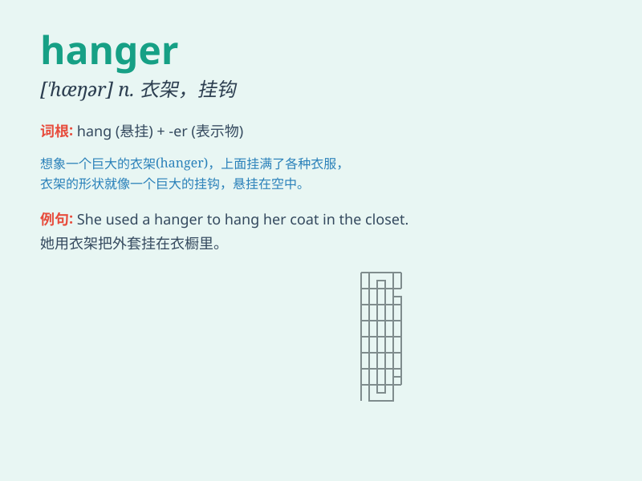

## hanger

**英音:** _[\'hæŋə]_ **美音:** _[\'hæŋɚ]_

**译义:** *n.绞刑执行者,衣架*

### 短语

+ **coat hanger:** _衣架；挂衣架_

+ **clothes hanger:** _衣架；挂衣服的架子_

+ **wire hanger:** _金属衣架_

+ **hanger rail:** _挂衣杆_

+ **hanger hook:** _衣架钩_

### 例句

#### 例句1

> **I need to buy some new hangers for my closet.**

**中文翻译:** 我需要为我的衣柜买一些新的衣架。

**单词释义:** 衣架

#### 例句2

> **The dress was hanging on a hanger in the store.**

**中文翻译:** 那件连衣裙挂在商店里的一个衣架上。

**单词释义:** 衣架

#### 例句3

> **She took the shirt off the hanger and put it on.**

**中文翻译:** 她从衣架上拿下衬衫穿上。

**单词释义:** 衣架

### 背诵小故事

> A poor little bird lost its way and needed a place to rest. It
finally found a hanger in an empty room. The hanger became its temporary
home.

**一只可怜的小鸟迷路了，需要一个地方休息。它最终在一个空房间里找到了一个衣架。这个衣架成了它暂时的家。**

### 图义

