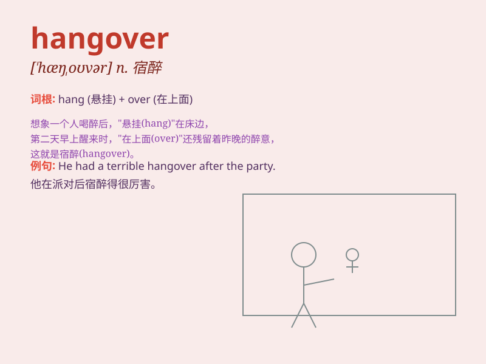

## hangover

**英音:** _[\'hæŋəʊvə]_ **美音:** _[\'hæŋ\'ovɚ]_

**译义:** *n.残留,遗物,宿醉*

### 短语

+ **have a hangover:** _宿醉_

+ **a bad hangover:** _严重的宿醉_

+ **suffer from a hangover:** _遭受宿醉之苦_

+ **get over a hangover:** _从宿醉中恢复_

+ **the morning-after hangover:** _次日清晨的宿醉_

### 例句

#### 例句1

> **I had a terrible hangover after the party last night.**

**中文翻译:** 昨晚聚会后，我宿醉得很厉害。

**单词释义:** 宿醉（因过量饮酒后第二天的不适）

#### 例句2

> **The economic hangover from the crisis is still affecting many
countries.**

**中文翻译:** 这场危机带来的经济后遗症仍在影响着许多国家。

**单词释义:** （不愉快事件的）遗留影响，后遗症

#### 例句3

> **He\'s still suffering from the emotional hangover of his
divorce.**

**中文翻译:** 他仍未从离婚带来的情感创伤中恢复过来。

**单词释义:** （不愉快经历的）残留影响，后遗症

### 背诵小故事

>
想象一下，昨晚你参加了一个疯狂派对，喝了太多酒。今天早上醒来，头痛欲裂，胃里翻江倒海，那种难受的感觉就是
\'hangover\' 。它就像一个恶魔缠着你，让你后悔昨晚的放纵。

**想象一下饮酒过量后第二天难受的宿醉感觉，这就是'hangover'，常指宿醉（酒后不适）**

### 图义

