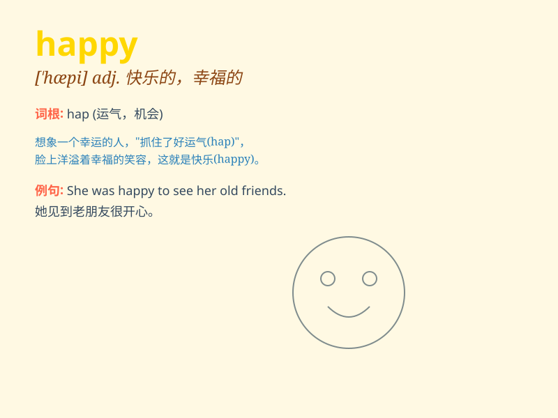

## happy

**英音:** _[\'hæpɪ]_ **美音:** _[\'hæpɪ]_

**译义:** *adj.快乐的,幸福的,陶醉于\...的,恰当的*

### 短语

+ **happy ending:** _美满的结局_

+ **happy hour:** _（酒吧等的）优惠时段_

+ **happy medium:** _折中的办法_

+ **happy family:** _幸福的家庭_

+ **happy birthday:** _生日快乐_

### 例句

#### 例句1

> **I\'m happy to see you again.**

**中文翻译:** 我很高兴再次见到你。

**单词释义:** 高兴的

#### 例句2

> **She has a happy family.**

**中文翻译:** 她有一个幸福的家庭。

**单词释义:** 幸福的

#### 例句3

> **The children look very happy playing in the park.**

**中文翻译:** 孩子们在公园里玩得很开心。

**单词释义:** 开心的

### 背诵小故事

> One day, a little girl went to the park. The sun was shining, and she
saw beautiful flowers. She played on the swing and laughed happily. At
that moment, she felt truly happy.

**有一天，一个小女孩去了公园。阳光明媚，她看到了美丽的花朵。她在秋千上玩耍并开心地大笑。在那一刻，她感到真正的快乐。**

### 图义

