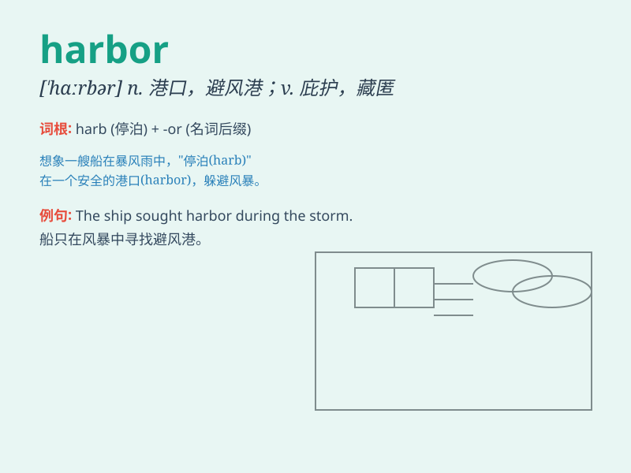

## harbor

**英音:** _[\'hɑ:bə]_ **美音:** _[\'hɑrbɚ]_

**译义:** *n.海港*

### 短语

+ **harbor resentment:** _心怀怨恨_

+ **harbor suspicion:** _心存怀疑_

+ **natural harbor:** _天然港_

+ **harbor refugees:** _收留难民_

+ **harbor evil intentions:** _怀有恶意_

### 例句

#### 例句1

> **The ship sought harbor during the storm.**

**中文翻译:** 这艘船在暴风雨中寻找港口。

**单词释义:** 港口；港湾

#### 例句2

> **He harbors a deep resentment towards his former boss.**

**中文翻译:** 他对他的前任老板怀有深深的怨恨。

**单词释义:** 怀有；心怀

#### 例句3

> **The small town is a harbor of peace and tranquility.**

**中文翻译:** 小镇是一个和平与安宁的港湾。

**单词释义:** 庇护所；避难所

### 背诵小故事

> A sailor was lost at sea. When he finally saw land, it was a
beautiful harbor. He felt safe and grateful. The harbor became his
refuge and hope. Remember, a harbor is a safe place for ships.

**一位水手在海上迷失了方向。当他最终看到陆地时，那是一个美丽的港湾。他感到安全和感激。这个港湾成了他的避难所和希望。记住，harbor
就是船只的安全之地。**

### 图义

