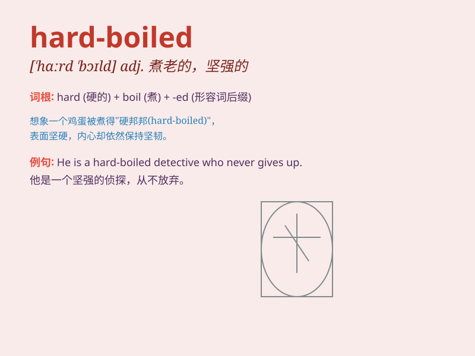

## hard-boiled

**英音:** _[ˌhɑːd ˈbɔɪld]_ **美音:** _[ˌhɑːrd ˈbɔɪld]_

**译义:** *adj.煮老的；无情的；强硬的*

### 短语

+ **hard-boiled egg:** _煮得老的鸡蛋_

+ **hard-boiled detective:** _冷酷无情的侦探_

+ **hard-boiled novel:** _硬汉派小说_

+ **hard-boiled style:** _强硬的风格_

+ **hard-boiled attitude:** _强硬的态度_

### 例句

#### 例句1

> **The hard-boiled detective was not easily fooled by the
criminal\'s lies.**

**中文翻译:** 这位冷酷的侦探不容易被罪犯的谎言所愚弄。

**单词释义:** 冷酷的；强硬的

#### 例句2

> **She has a hard-boiled attitude towards life and never gives up
easily.**

**中文翻译:** 她对生活有一种强硬的态度，从不轻易放弃。

**单词释义:** 强硬的；坚定的

#### 例句3

> **The hard-boiled egg is ready to be eaten.**

**中文翻译:** 煮得老的鸡蛋可以吃了。

**单词释义:** 煮得老的

### 背诵小故事

> A detective was known as hard-boiled. He faced many tough cases but
remained tough and unemotional. No matter how dangerous, he stayed calm
and determined. His hard-boiled nature made him a legend in the police
force.

**一位侦探被认为是强硬的。他面对许多棘手的案件，但仍然坚韧且不动感情。无论多么危险，他都保持冷静和坚定。他强硬的性格使他在警队中成为了一个传奇。**

### 图义

