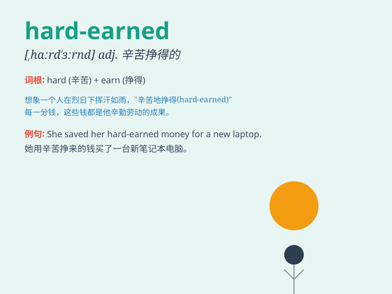

## hard-earned

**英音:** _[hɑːrd ɜːrnd]_ **美音:** _[hɑːrd ɜːrnd]_

**译义:** *adj. 辛苦挣得的；来之不易的*

### 短语

+ **hard-earned money:** _辛苦挣来的钱_

+ **hard-earned experience:** _来之不易的经验_

+ **hard-earned reputation:** _辛苦赢得的声誉_

+ **hard-earned victory:** _来之不易的胜利_

+ **hard-earned rest:** _难得的休息_

### 例句

#### 例句1

> **The money she saved was hard-earned through long hours of
work.**

**中文翻译:** 她存下来的钱是通过长时间工作辛苦挣来的。

**单词释义:** 通过辛苦工作获得的

#### 例句2

> **He finally achieved success with his hard-earned experience.**

**中文翻译:** 他最终凭借自己来之不易的经验取得了成功。

**单词释义:** 来之不易的

#### 例句3

> **We should cherish the hard-earned peace.**

**中文翻译:** 我们应该珍惜这来之不易的和平。

**单词释义:** 来之不易的

### 背诵小故事

> A poor student spent countless nights studying hard. Finally, he got
a high score. The money he earned from a scholarship was hard-earned. It
was the result of his perseverance and effort.

**一个贫困的学生花费了无数个夜晚努力学习。最终，他取得了高分。他从奖学金中获得的钱是来之不易的。这是他坚持不懈和努力的结果。**

### 图义

