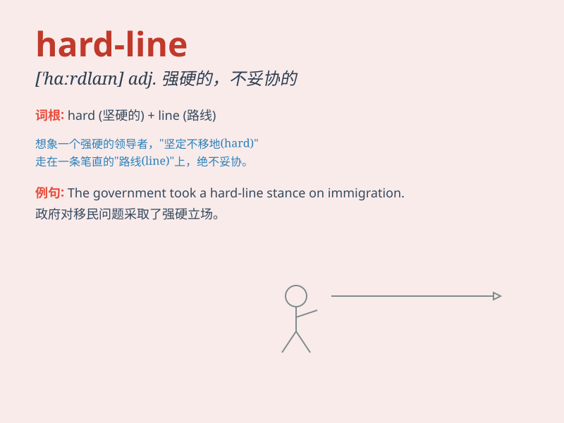

## hard-line

**英音:** _[hɑːrd laɪn]_ **美音:** _[hɑːrd laɪn]_

**译义:** *adj. 强硬的；不妥协的；严格的 n.
强硬路线；不妥协的态度*

### 短语

+ **hard-line policy:** _强硬政策_

+ **hard-line stance:** _强硬立场_

+ **hard-line approach:** _强硬手段；强硬方法_

+ **hard-line attitude:** _强硬态度_

+ **take a hard-line:** _采取强硬路线_

### 例句

#### 例句1

> **The government has taken a hard-line stance on immigration.**

**中文翻译:** 政府在移民问题上采取了强硬立场。

**单词释义:** 强硬的

#### 例句2

> **He is known for his hard-line approach to business
negotiations.**

**中文翻译:** 他以在商务谈判中采取强硬手段而闻名。

**单词释义:** 强硬的；不妥协的

#### 例句3

> **The new manager has implemented a hard-line policy to improve
productivity.**

**中文翻译:** 新经理实施了一项强硬的政策以提高生产力。

**单词释义:** 强硬的；严格的

### 背诵小故事

> A politician was known for his hard-line stance. He never
compromised, even when everyone else suggested a more flexible approach.
It was like he was a stubborn rock, unmovable. This showed how
\'hard-line\' means being strict and unyielding.

**一位政客以其强硬立场而闻名。他从不妥协，即使其他人都建议采取更灵活的方法。就像他是一块顽固的石头，不可动摇。这展示了'hard-line'意思是强硬的、不妥协的。**

### 图义

