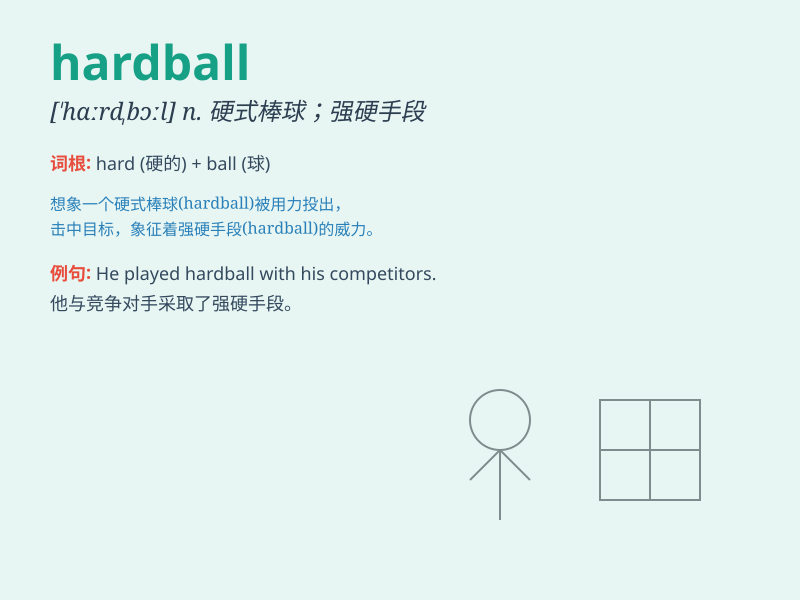

## hardball

**英音:** _[\'hɑːdbɔːl]_ **美音:** _[\'hɑrd\'bɔl]_

**译义:** *n.硬式棒球*

### 短语

+ **play hardball:** _采取强硬手段_

+ **hardball tactics:** _强硬策略_

+ **throw hardball:** _投出硬球（喻指采取严厉措施）_

+ **deal in hardball:** _以强硬方式处理_

+ **resort to hardball:** _诉诸强硬手段_

### 例句

#### 例句1

> **The politician was known for playing hardball in
negotiations.**

**中文翻译:** 这位政客以在谈判中采取强硬态度而闻名。

**单词释义:** 强硬手段

#### 例句2

> **In business, sometimes you have to play hardball to get what you
want.**

**中文翻译:** 在商业上，有时你必须采取强硬手段才能得到你想要的东西。

**单词释义:** 强硬策略

#### 例句3

> **The coach decided to play hardball with the team to improve their
performance.**

**中文翻译:** 教练决定对球队采取强硬态度，以提高他们的表现。

**单词释义:** 强硬措施

### 背诵小故事

> A baseball player was struggling to play hardball. But with
determination, he practiced every day. Finally, he could hit the
hardball far and became a star. It shows that facing hardball situations
requires effort and perseverance.

**一位棒球运动员起初难以打好硬式棒球。但凭借决心，他每天练习。最终，他能把硬式棒球击打得很远，成为了明星。这表明面对困难的局面（像硬式棒球）需要努力和坚持。**

### 图义

