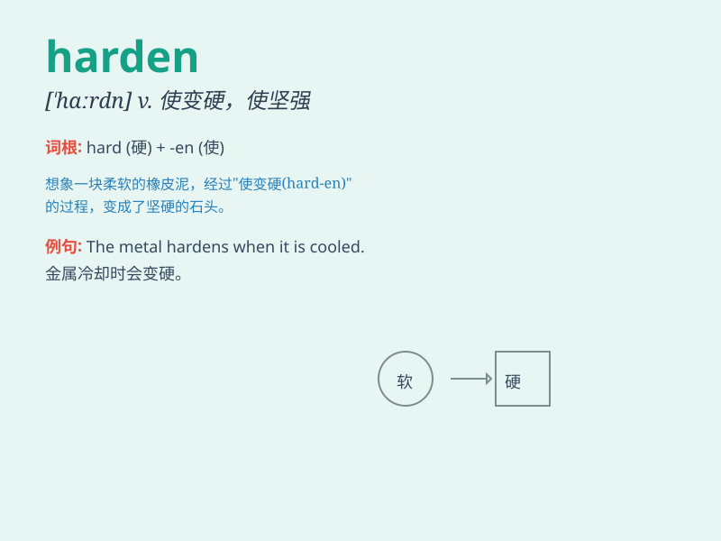

## harden

**英音:** _[\'hɑːd(ə)n]_ **美音:** _[\'hɑrdn]_

**译义:** *vt.使变硬,使坚强,使冷酷vi.变硬,变冷酷,涨价*

### 短语

+ **harden into:** _变得坚硬；变得确定_

+ **harden up:** _使坚强；使强硬_

+ **harden one\'s heart:** _硬起心肠_

+ **harden off:** _（使幼苗）受冷而变得耐寒_

+ **harden against:** _对\...变得冷酷无情_

### 例句

#### 例句1

> **The heat will harden the clay.**

**中文翻译:** 热量会使粘土变硬。

**单词释义:** 使变硬

#### 例句2

> **Her attitude has hardened over the years.**

**中文翻译:** 多年来，她的态度变得强硬。

**单词释义:** 变得强硬

#### 例句3

> **The experience has hardened him against further setbacks.**

**中文翻译:** 这段经历使他更加坚强，能够抵御进一步的挫折。

**单词释义:** 使坚强

### 背诵小故事

> A young blacksmith was constantly heating and cooling the iron to
harden it. He worked hard every day, making the metal strong and tough.
Just like the iron, we need to go through challenges to harden our minds
and spirits.

**一位年轻的铁匠不断加热和冷却铁块来使其变硬。他每天努力工作，让金属变得坚固和坚韧。就像铁块一样，我们需要经历挑战来使我们的思想和精神变得坚强。**

### 图义

