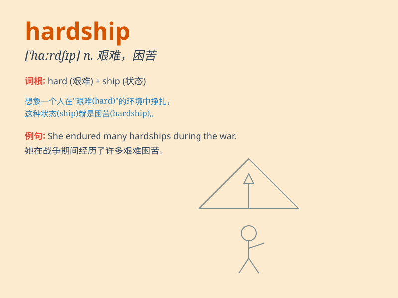

## hardship

**英音:** _[\'hɑːdʃɪp]_ **美音:** _[\'hɑrdʃɪp]_

**译义:** *n.困苦,艰难,辛苦*

### 短语

+ **economic hardship:** _经济困难_

+ **endure hardship:** _忍受艰难_

+ **face hardship:** _面对困难_

+ **overcome hardship:** _克服困难_

+ **experience hardship:** _经历艰难_

### 例句

#### 例句1

> **She has endured many hardships in her life.**

**中文翻译:** 她这一生经历了很多磨难。

**单词释义:** 艰难；困苦；艰难情况

#### 例句2

> **The family faced financial hardship after the father lost his
job.**

**中文翻译:** 父亲失业后，家庭面临经济困难。

**单词释义:** 困难；困境

#### 例句3

> **Overcoming these hardships will make you stronger.**

**中文翻译:** 克服这些困难会让你变得更坚强。

**单词释义:** 艰难；苦难

### 背诵小故事

> A poor student had to walk a long way to school every day, facing bad
weather and having no money for lunch. These were his hardships. But he
never gave up and finally succeeded.

**一个贫困的学生每天都要走很长的路去上学，面临恶劣的天气，还没钱吃午饭。这些都是他的艰难困苦。但他从未放弃，最终成功了。**

### 图义

