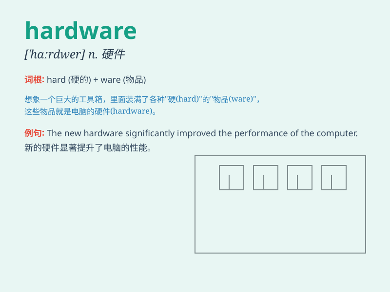

## hardware

**英音:** _[\'hɑːdweə]_ **美音:** _[\'hɑrdwɛr]_

**译义:** *n.五金器具,(电脑的)硬件,(电子仪器的)部件*

### 短语

+ **computer hardware:** _计算机硬件_

+ **hardware store:** _五金店_

+ **hardware component:** _硬件组件_

+ **network hardware:** _网络硬件_

+ **hardware engineer:** _硬件工程师_

### 例句

#### 例句1

> **We need to upgrade the hardware of our computer to run the new
software smoothly.**

**中文翻译:** 我们需要升级电脑的硬件才能顺利运行新软件。

**单词释义:** （计算机的）硬件

#### 例句2

> **The store sells a wide range of hardware, from nails to power
tools.**

**中文翻译:** 这家商店出售各种五金制品，从钉子到电动工具。

**单词释义:** 五金器具

#### 例句3

> **The hardware on this door is old and needs to be replaced.**

**中文翻译:** 这扇门上的硬件很旧，需要更换。

**单词释义:** （门窗的）金属配件

### 背诵小故事

> One day, a little robot was malfunctioning. The engineer found that
the problem was in the \'hardware\' like its gears and circuits. He
fixed them, and the robot worked well again. Hardware is the physical
components of a machine!

**有一天，一个小机器人出故障了。工程师发现问题出在像齿轮和电路这样的"硬件"上。他修好了它们，机器人又能正常工作了。硬件就是机器的物理组件！**

### 图义

