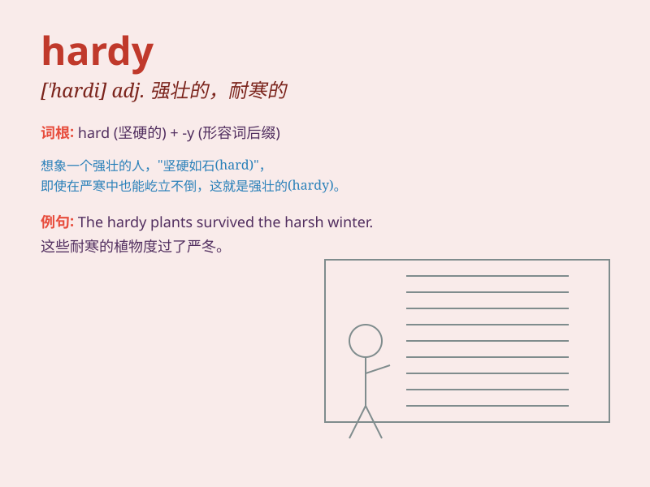

## hardy

**英音:** _[ˈhɑːdi]_ **美音:** _[ˈhɑːrdi]_

**译义:** *adj.难的,艰苦的,勇敢的adv.努力地,辛苦地,坚硬地*

### 短语

+ **hardy annual:** _耐寒一年生植物_

+ **hardy breed:** _耐寒品种_

+ **hardy soul:** _坚强的灵魂_

+ **hardy plant:** _耐寒植物_

+ **hardy spirit:** _坚韧的精神_

### 例句

#### 例句1

> **The hardy mountaineers were not deterred by the harsh
weather.**

**中文翻译:** 顽强的登山者并没有被恶劣的天气吓倒。

**单词释义:** 强壮的；能吃苦耐劳的

#### 例句2

> **These plants are very hardy and can survive in poor
conditions.**

**中文翻译:** 这些植物非常耐寒，可以在恶劣的条件下生存。

**单词释义:** 耐寒的；适应力强的

#### 例句3

> **The hardy explorers ventured into the unknown territory.**

**中文翻译:** 勇敢的探险家们冒险进入未知的领域。

**单词释义:** 勇敢的；有勇气的

### 背诵小故事

> A brave adventurer named Hardy was always ready for tough challenges.
No matter how hard the journey was, Hardy never gave up. His spirit
showed what \'hardy\' means - strong and brave in difficult situations.

**一位名叫哈迪的勇敢冒险家总是准备好迎接艰难的挑战。无论旅途多么艰辛，哈迪从不放弃。他的精神展现了\'hardy\'这个词的含义------在困难情况下坚强勇敢。**

### 图义

