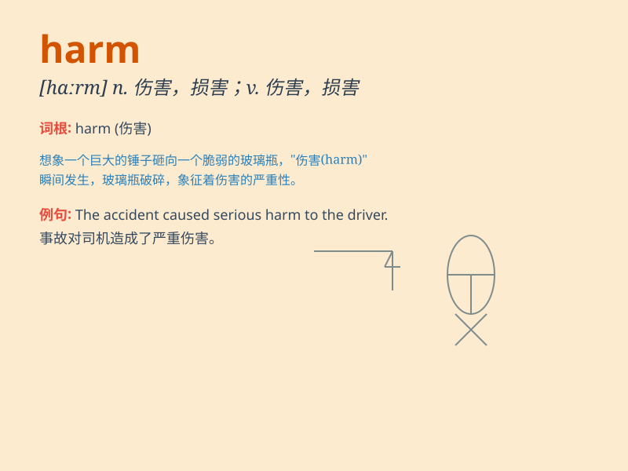

## harm

**英音:** _[hɑːm]_ **美音:** _[hɑrm]_

**译义:** *vt.伤害,损害n.伤害,损害*

### 短语

+ **do harm to:** _对\...\...有害_

+ **come to no harm:** _未受到伤害_

+ **mean no harm:** _没有恶意_

+ **out of harm\'s way:** _在安全的地方_

+ **physical harm:** _身体伤害_

### 例句

#### 例句1

> **Smoking can cause serious harm to your health.**

**中文翻译:** 吸烟会对您的健康造成严重危害。

**单词释义:** 危害；损害

#### 例句2

> **The storm did little harm to the crops.**

**中文翻译:** 暴风雨对农作物影响不大。

**单词释义:** 损害；伤害

#### 例句3

> **It wouldn\'t do him any harm to work a bit harder.**

**中文翻译:** 多努力一点也不会对他有什么坏处。

**单词释义:** 伤害；不利

### 背诵小故事

> A naughty monkey was playing in the forest. It accidentally broke a
beehive and was stung many times. This caused harm to the monkey. From
then on, it learned to be careful and not do things that could cause
harm.

**一只顽皮的猴子在森林里玩耍。它不小心弄破了一个蜂窝，被蜇了好多下。这给猴子造成了伤害。从那以后，它学会了小心，不做会造成伤害的事。**

### 图义

