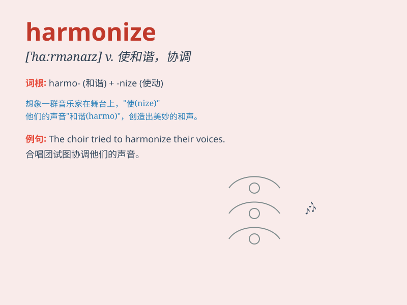

## harmonize

**英音:** _[\'hɑːmənaɪz]_ **美音:** _[\'hɑrmənaɪz]_

**译义:** *v.协调*

### 短语

+ **harmonize with:** _与\...\...协调；与\...\...和谐_

+ **harmonize relations:** _协调关系_

+ **harmonize colors:** _协调色彩_

+ **harmonize schedules:** _协调日程安排_

+ **harmonize efforts:** _协调努力_

### 例句

#### 例句1

> **The colors of the room harmonize perfectly with the
furniture.**

**中文翻译:** 房间的颜色与家具完美协调。

**单词释义:** （使）协调；（使）和谐

#### 例句2

> **The choir tried to harmonize the difficult piece of music.**

**中文翻译:** 合唱团试图协调这首困难的音乐。

**单词释义:** （使）和声；（使）协调一致

#### 例句3

> **It\'s important to harmonize your work and life.**

**中文翻译:** 协调工作和生活很重要。

**单词释义:** 使协调；使和谐

### 背诵小故事

> A group of musicians were struggling to play together. But when they
learned to harmonize their different instruments, the music became
beautiful and enchanting. Just like this, \'harmonize\' means to make
things in agreement and balance.

**一群音乐家起初演奏配合得很糟糕。但当他们学会协调各自不同的乐器时，音乐变得美妙迷人。就像这样，\'harmonize\'意思是使事物协调一致、和谐平衡。**

### 图义

